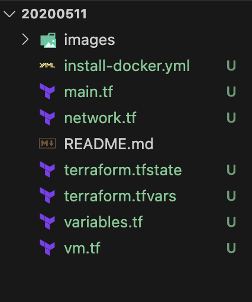
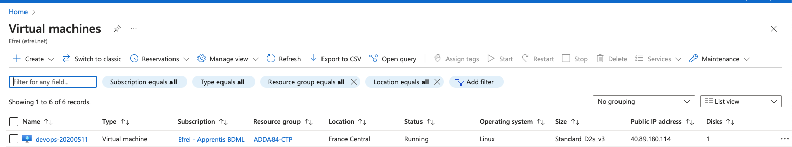

# DEVOPS - TP4: Cloud - Terraform

### Objectives
- Create an Azure Virtual Machine (VM) with a public IP address in an existing network (network-tp4).
- Utilize Terraform.
- Connect to the VM using SSH.
- Understand the different Azure services (ACI vs. AVM).
- Make the code available in a GitHub repository.

**Help**: [Azure CLI Logging into the Azure CLI](https://registry.terraform.io/providers/hashicorp/azurerm/latest/docs/guides/azure_cli#logging-into-the-azure-cli)

Remember to run `terraform destroy` when you're finished!

## Constraints
- Location: France Central
- Azure Subscription ID: `765266c6-9a23-4638-af32-dd1e32613047`
- Azure resource group: `ADDA84-CTP`
- Network: `network-tp4`
- Subnet: `internal`
- Azure VM name: `devops-<your-efrei-identifier>`
- VM size: `Standard_D2s_v3`
- Use Azure CLI for authentication
- VM administrator user: `devops`
- Create an SSH key with Terraform
- OS: Ubuntu 22.04

## Grading
- Code available on GitHub
- `terraform apply` and `terraform destroy` that work
- Following command works with your VM's public IP address:
  ```
  ssh -i id_rsa devops@{PUBLIC_ADDRESS_IP} cat /etc/os-release
  ```

## Bonus
- Launch a script at machine startup that installs Docker with cloud-init
- No code duplication (use of variables)
- Terraform code properly formatted (provide the command used)

# DevOps Infrastructure as code Project - Deploying with Terraform to Azure

## Introduction

In continuation of advancing our DevOps expertise, Practical Work #4 dives into the realm of cloud infrastructure provisioning and management using Terraform. This practical work aims to explore the intricacies of automating the deployment of Azure resources while adhering to infrastructure as code (IaC) principles.

Our primary objectives in this practical work include:
- Creating an Azure Virtual Machine (VM) with a public IP address within an existing network, leveraging the power of Terraform for streamlined provisioning.
- Establishing SSH connectivity to the VM for seamless administration and interaction.
- Gaining insights into the Azure ecosystem by understanding the distinctions between Azure Container Instances (ACI) and Azure Virtual Machines (AVM).
- Ensuring code reusability and collaboration by hosting our Terraform scripts in a dedicated GitHub repository.

By following the guidelines outlined in this practical work, we will navigate through the process of deploying a resilient and scalable infrastructure on Azure. We'll adhere to specific constraints and configurations, such as the location, Azure subscription, and resource group, to ensure consistency and alignment with industry best practices.

Let's embark on this journey of cloud infrastructure automation with Terraform, reinforcing our understanding of DevOps principles and practices in today's dynamic technological landscape.

## Architecture

To meet the project's requirements, the following architecture has been employed:

## Components

- **main.tf**: This file serves as the main configuration entry point for Terraform. It declares the Terraform version being used, required providers, and sets up the local backend configuration for storing Terraform state. It also configures the Azure provider and TLS provider.

- **network.tf**: This file defines the network infrastructure components such as virtual networks, subnets, network interfaces, and public IP addresses required for the project. It retrieves existing network information and creates necessary resources like network interfaces and public IP addresses.

- **terraform.tfstate**: This file stores the current state of the infrastructure managed by Terraform. It keeps track of resource metadata and dependencies to ensure proper resource management and state consistency.

- **terraform.tfvars**: This file contains input variables used to customize the Terraform configuration. It sets default values for variables such as resource group name, location, and unique identifier for the VM.

- **variables.tf**: This file defines input variables used throughout the Terraform configuration. It specifies variable types, descriptions, and default values to maintain consistency and manage configurations effectively.

- **vm.tf**: This file defines the Azure virtual machine (VM) resource along with its configurations such as name, location, size, OS disk settings, SSH key configurations, and custom data for cloud-init. It also generates SSH key pairs and stores them locally.

- **Install-docker.yml**: This file is a cloud-init script used to automate the installation of Docker on an Ubuntu system. 

## Diagram



## Code

### main.tf

This Terraform configuration sets up the required provider dependencies, including Azure and TLS, and configures a local backend for storing Terraform state. It also specifies the configuration for the Azure provider, enabling additional features and skipping automatic registration.

```tf
# Declaration of the Terraform version and required providers
terraform {
  required_providers {
    # Azure Provider
    azurerm = {
      source  = "hashicorp/azurerm"
      version = "~> 3.0"
    }
    # TLS Provider
    tls = {
      source  = "hashicorp/tls"
      version = "~> 3.1"
    }
  }
  # Configuration of the backend to store Terraform state locally
  backend "local" {
    path = "terraform.tfstate"  # Path where Terraform state will be stored locally
  }
}

# Configuration of the Azure provider
provider "azurerm" {
  features {}  # Enable additional features of the Azure provider
  skip_provider_registration = true  # Skip automatic registration of the Azure provider
}
```

- **Terraform Block** (`terraform`):
  - Declares the Terraform version being used and the required providers.
  - Specifies the versions of the Azure and TLS providers required for this configuration.
  - Configures a local backend to store the Terraform state file (`terraform.tfstate`) locally on disk.

- **Azure Provider Configuration** (`provider "azurerm"`):
  - Specifies the configuration for the Azure provider.
  - Enables additional features of the Azure provider, if any.
  - `skip_provider_registration` is set to `true` to skip the automatic registration of the Azure provider. This is useful in scenarios where the provider registration is handled externally.

### vm.tf

This Terraform configuration defines an Azure Linux virtual machine with specific settings, including SSH key authentication and injection of a custom Docker installation script. It also generates SSH key pairs and stores them locally for authentication purposes.

```tf
# Definition of the Azure Linux VM resource
resource "azurerm_linux_virtual_machine" "devops_vm" {
  # Virtual machine name
  name                  = "devops-${var.identifiant_efrei}"
  # Resource location
  location              = var.location
  # Resource group to which the VM is associated
  resource_group_name   = var.resource_group
  # ID of the network interface to attach to the VM
  network_interface_ids = [azurerm_network_interface.devops_ni.id]
  # VM size
  size                  = "Standard_D2s_v3"

  # Configuration of the OS disk
  os_disk {
    name                 = "myosdisk"
    caching              = "ReadWrite"
    storage_account_type = "Standard_LRS"
  }

  # Source image reference
  source_image_reference {
    publisher = "Canonical"
    offer     = "0001-com-ubuntu-server-focal"
    sku       = "20_04-lts-gen2"
    version   = "latest"
  }

  # Administrator username
  admin_username                  = "devops"
  # Disable password authentication
  disable_password_authentication = true
  # Configuration of the administrator's SSH key
  admin_ssh_key {
    username   = "devops"
    public_key = tls_private_key.ssh_key.public_key_openssh
  }

  # Custom data to inject into the VM (Docker installation script)
  custom_data = base64encode(file("${path.module}/Install-docker.yml"))
}
```

- **Resource Block** (`resource "azurerm_linux_virtual_machine" "devops_vm"`):
  - Defines an Azure Linux virtual machine resource with the specified configurations.
  - The VM name is constructed using the provided identifier from variables.
  - Specifies the VM's location, resource group, network interface ID, size, and other settings.
  - Configures the OS disk, including its name, caching options, and storage account type.
  - Specifies the source image reference for the VM.
  - Sets the administrator username and disables password authentication.
  - Configures the administrator's SSH key for authentication.
  - Injects custom data (base64 encoded) into the VM, which includes the Docker installation script.

- **SSH Key Pair Generation** (`resource "tls_private_key" "ssh_key"`):
  - Generates a pair of SSH keys for authentication purposes.

- **Public Key File Storage** (`resource "local_file" "public_key"`):
  - Stores the public SSH key in a local file for reference.

- **Private Key File Storage** (`resource "local_sensitive_file" "private_key"`):
  - Stores the private SSH key in a local file with restricted permissions for security.

### network.tf

This Terraform configuration retrieves existing network information, creates a network interface associated with a specific subnet, and assigns a static public IP address for connectivity. It ensures proper network configuration for the deployment of Azure resources.

```tf
# Retrieval of existing network information
data "azurerm_virtual_network" "tp4_vnet" {
  name                = "network-tp4"
  resource_group_name = var.resource_group
}

# Retrieval of existing subnet information
data "azurerm_subnet" "internal_subnet" {
  name                 = "internal"
  virtual_network_name = data.azurerm_virtual_network.tp4_vnet.name
  resource_group_name  = var.resource_group
}

# Creation of the network interface
resource "azurerm_network_interface" "devops_ni" {
  name                = "devops-ni"
  location            = var.location
  resource_group_name = var.resource_group

  ip_configuration {
    name                          = "internal"
    subnet_id                     = data.azurerm_subnet.internal_subnet.id
    private_ip_address_allocation = "Dynamic"
    public_ip_address_id          = azurerm_public_ip.devops_public_ip.id
  }
}

# Creation of the public IP address
resource "azurerm_public_ip" "devops_public_ip" {
  name                = "devops-public-ip"
  location            = var.location
  resource_group_name = var.resource_group
  allocation_method   = "Static"
}
```

- **Virtual Network Information Retrieval** (`data "azurerm_virtual_network" "tp4_vnet"`):
  - Retrieves information about the existing virtual network named "network-tp4" within the specified resource group.
  - Uses this data to define a data source for the virtual network.

- **Subnet Information Retrieval** (`data "azurerm_subnet" "internal_subnet"`):
  - Retrieves information about the existing subnet named "internal" within the previously retrieved virtual network.
  - Uses the virtual network data source to specify the virtual network context.
  - Defines a data source for the subnet.

- **Network Interface Creation** (`resource "azurerm_network_interface" "devops_ni"`):
  - Creates a network interface named "devops-ni" in the specified location and resource group.
  - Configures an IP configuration for the network interface, associating it with the retrieved subnet and specifying dynamic private IP address allocation.
  - Associates a public IP address with the network interface, using the ID of the public IP address resource to ensure connectivity.

- **Public IP Address Creation** (`resource "azurerm_public_ip" "devops_public_ip"`):
  - Creates a static public IP address named "devops-public-ip" in the specified location and resource group.

### terraform.tfstate

This Terraform state file provides metadata about the Terraform environment, including version information, lineage, and resource state. It serves as a snapshot of the infrastructure managed by Terraform and is used to track changes and manage resource dependencies.

```tf
{
  "version": 4,
  "terraform_version": "1.5.7",
  "serial": 41,
  "lineage": "9ab9c4d0-9e0d-838c-a3a0-134d4b900440",
  "outputs": {},
  "resources": [],
  "check_results": null
}
```

- **Version** (`"version": 4`):
  - Indicates the version of the Terraform state file format being used.

- **Terraform Version** (`"terraform_version": "1.5.7"`):
  - Specifies the version of Terraform that generated this state file.

- **Serial** (`"serial": 41`):
  - Represents the serial number of this state file. It increments each time the state is updated.

- **Lineage** (`"lineage": "9ab9c4d0-9e0d-838c-a3a0-134d4b900440"`):
  - Refers to a unique identifier for the lineage of this state file. It helps track changes across different versions of the state.

- **Outputs** (`"outputs": {}`):
  - Contains any output values defined in the Terraform configuration. Currently empty in this state file.

- **Resources** (`"resources": []`):
  - Lists the managed resources (such as Azure VMs, networks, etc.) defined in the Terraform configuration. Currently empty in this state file.

- **Check Results** (`"check_results": null`):
  - Stores the results of any resource checks performed during the last apply operation. Currently null, indicating no errors or warnings.

### terraform.tfvars

This Terraform variables file defines values for input variables used in the Terraform configuration. It provides customization options for configuring the deployment environment, such as the resource group name, location, and an identifier specific to Efrei. These values can be easily modified to adapt to different deployment scenarios.

```tf
# Fichier terraform.tfvars
resource_group    = "ADDA84-CTP"
location          = "francecentral"
identifiant_efrei = "20200511"
```

- **Resource Group** (`resource_group = "ADDA84-CTP"`):
  - Specifies the name of the Azure resource group where the resources will be deployed. It is set to "ADDA84-CTP".

- **Location** (`location = "francecentral"`):
  - Specifies the Azure region where the resources will be deployed. It is set to "francecentral".

- **Identifier Efrei** (`identifiant_efrei = "20200511"`):
  - Represents an identifier, possibly specific to Efrei, set to "20200511".

### variables.tf

These Terraform variable definitions allow for customization of deployment parameters such as resource group name, location, and VM identifier. Default values are provided for convenience but can be overridden during Terraform execution if needed.

```tf
# Définition de la variable pour le groupe de ressources
variable "resource_group" {
  default = "ADDA84-CTP"  # Valeur par défaut du nom du groupe de ressources
}

# Définition de la variable pour l'emplacement
variable "location" {
  default = "francecentral"  # Valeur par défaut de l'emplacement
}

# Définition de la variable pour l'identifiant unique de la VM
variable "identifiant_efrei" {
  type        = string  # Type de la variable (chaîne de caractères)
  description = "Identifiant unique pour le nom de la VM."  # Description de la variable
}
```

- **Resource Group Variable** (`variable "resource_group"`):
  - Defines a variable named "resource_group" to specify the name of the Azure resource group where resources will be deployed.
  - It has a default value set to "ADDA84-CTP" if not explicitly provided.

- **Location Variable** (`variable "location"`):
  - Defines a variable named "location" to specify the Azure region where resources will be deployed.
  - It has a default value set to "francecentral" if not explicitly provided.

- **Identifier Efrei Variable** (`variable "identifiant_efrei"`):
  - Defines a variable named "identifiant_efrei" to specify a unique identifier for the VM name, possibly specific to Efrei.
  - It is of type string and has a description provided for clarity.

### install-docker.yml

This script automates the installation of Docker on an Ubuntu system by updating packages, adding necessary repositories, and installing Docker packages along with Docker CLI and containerd. It ensures a streamlined process for setting up Docker on the target system.

```yml
#cloud-config
# Indique que ce fichier est un script cloud-init.

# Met à jour tous les paquets du système avant d'installer de nouveaux paquets.
package_upgrade: true

# Liste des paquets à installer qui sont nécessaires pour installer Docker.
packages:
  - apt-transport-https       # Permet à APT d'utiliser des repos sur HTTPS
  - ca-certificates           # Permet à la machine de vérifier la sécurité des certificats SSL
  - curl                      # Outil de transfert de données utilisé pour les commandes ci-dessous
  - software-properties-common # Fournit un outil de gestion des sources de logiciels
  - lsb-release               # Fournit des informations sur la distribution Linux

# Liste des commandes à exécuter pour installer Docker.
runcmd:
  - curl -fsSL https://download.docker.com/linux/ubuntu/gpg | sudo apt-key add -
    # Télécharge la clé GPG officielle de Docker et l'ajoute au système de gestion des paquets,
    # nécessaire pour s'assurer que les paquets téléchargés sont authentiques.

  - sudo add-apt-repository "deb [arch=amd64] https://download.docker.com/linux/ubuntu $(lsb_release -cs) stable"
    # Ajoute le dépôt officiel de Docker aux sources APT de Ubuntu, pour la version stable de Docker,
    # et pour l'architecture amd64.

  - sudo apt-get update
    # Met à jour l'index des paquets après l'ajout du nouveau dépôt Docker.

  - sudo apt-get install -y docker-ce docker-ce-cli containerd.io
    # Installe Docker, Docker CLI et containerd, qui sont nécessaires pour exécuter des conteneurs Docker.

  - sudo usermod -aG docker $USER
    # Ajoute l'utilisateur actuel au groupe Docker, permettant d'exécuter des commandes Docker sans sudo.
```

- **Cloud-Init Script Header**:
  - Indicates that this file is a cloud-init script, which is commonly used for initializing cloud instances.

- **Package Upgrade**:
  - Ensures that all system packages are updated before installing new packages.

- **Package Installation**:
  - Defines a list of packages necessary for installing Docker, including `apt-transport-https`, `ca-certificates`, `curl`, `software-properties-common`, and `lsb-release`.

- **Installation Commands**:
  - Executes a series of commands to install Docker:
    - Adds the official Docker GPG key to the package manager system.
    - Adds the Docker repository to the APT sources list for Ubuntu.
    - Updates the package index after adding the Docker repository.
    - Installs Docker, Docker CLI, and containerd packages.
    - Adds the current user to the Docker group to allow running Docker commands without `sudo`.

## Output 

### Terraform Format Command 

The `terraform fmt` command is used to rewrite Terraform configuration files to a canonical format and style. This command applies a subset of the Terraform language style conventions, along with other minor adjustments for readability. 

#### Input 

```bash
terraform fmt
```

#### Output

```shell
main.tf
variables.tf
vm.tf
```

Using `terraform fmt` helps in maintaining uniformity in code layout and style across our entire code base, making it easier to read and understand. Here are some benefits of using this command:
- **Consistency**: Ensures that our code follows Terraform's recommended formatting.
- **Readability**: Improves the readability and thus the maintainability of our Terraform configurations.
- **Version Control Friendly**: Reduces diff sizes in version control by standardizing formatting.

### Terraform Init Command

The `terraform init` command is used to initialize a working directory containing Terraform configuration files. 

#### Input 

```bash
terraform init
```

#### Output

```shell
Initializing the backend...

Successfully configured the backend "local"! Terraform will automatically
use this backend unless the backend configuration changes.

Initializing provider plugins...
- Finding latest version of hashicorp/local...
- Finding hashicorp/azurerm versions matching "~> 3.0"...
- Finding hashicorp/tls versions matching "~> 3.1"...
- Installing hashicorp/local v2.5.1...
- Installed hashicorp/local v2.5.1 (signed by HashiCorp)
- Installing hashicorp/azurerm v3.100.0...
- Installed hashicorp/azurerm v3.100.0 (signed by HashiCorp)
- Installing hashicorp/tls v3.4.0...
- Installed hashicorp/tls v3.4.0 (signed by HashiCorp)

Terraform has created a lock file .terraform.lock.hcl to record the provider
selections it made above. Include this file in your version control repository
so that Terraform can guarantee to make the same selections by default when
you run "terraform init" in the future.

Terraform has been successfully initialized!

You may now begin working with Terraform. Try running "terraform plan" to see
any changes that are required for your infrastructure. All Terraform commands
should now work.

If you ever set or change modules or backend configuration for Terraform,
rerun this command to reinitialize your working directory. If you forget, other
commands will detect it and remind you to do so if necessary.
```

Terraform initialization is successful

### Terraform Validate Command

The `terraform validate` command is used to check whether a Terraform configuration is syntactically valid and internally consistent, without accessing any remote services or state. 

#### Input

```bash
terraform validate
```

#### Output

```shell
Success! The configuration is valid.
```

Validation is a useful step before applying a Terraform plan, as it can catch errors and inconsistencies that might otherwise lead to failed deployments. It's a quick way to verify that:
- The configuration syntax is correct.
- All required arguments are provided.
- There are no cyclic dependencies or other logical errors within the configuration.


### Terraform Plan Command

The `terraform plan` command is used to create an execution plan, which lets us preview the changes that Terraform plans to make to our infrastructure. This command is a key part of Terraform's workflow and is used for checking what will be done before actually applying the changes. 

#### Input

```bash
terraform plan
```

#### Output

```shell
data.azurerm_virtual_network.tp4_vnet: Reading...
data.azurerm_virtual_network.tp4_vnet: Read complete after 0s [id=/subscriptions/765266c6-9a23-4638-af32-dd1e32613047/resourceGroups/ADDA84-CTP/providers/Microsoft.Network/virtualNetworks/network-tp4]
data.azurerm_subnet.internal_subnet: Reading...
data.azurerm_subnet.internal_subnet: Read complete after 1s [id=/subscriptions/765266c6-9a23-4638-af32-dd1e32613047/resourceGroups/ADDA84-CTP/providers/Microsoft.Network/virtualNetworks/network-tp4/subnets/internal]

Terraform used the selected providers to generate the following execution plan. Resource actions are indicated with the following symbols:
  + create

Terraform will perform the following actions:

  # azurerm_linux_virtual_machine.devops_vm will be created
  + resource "azurerm_linux_virtual_machine" "devops_vm" {
      + admin_username = "devops"
      ...
    }

  # azurerm_network_interface.devops_ni will be created
  + resource "azurerm_network_interface" "devops_ni" {
      + name = "devops-ni"
      ...
    }

  # azurerm_public_ip.devops_public_ip will be created
  + resource "azurerm_public_ip" "devops_public_ip" {
      + name = "devops-public-ip"
      ...
    }

Plan: 6 to add, 0 to change, 0 to destroy.

Note: You didn't use the -out option to save this plan, so Terraform can't guarantee to take exactly these actions if you run "terraform apply" now.
```

This command is crucial for:
- **Safety**: Ensuring that changes are predictable and safe.
- **Visibility**: Providing visibility into what Terraform will do before any changes are made, preventing any unexpected changes.
- **Verification**: Allowing both manual oversight and automated checks to verify that the planned actions are correct before applying them.

# Terraform Apply Command

The `terraform apply` command is used to apply the changes required to reach the desired state of the configuration, as determined by `terraform plan`. 

#### Input

```bash
terraform apply
```

#### Output

```shell
data.azurerm_virtual_network.tp4_vnet: Reading...
data.azurerm_virtual_network.tp4_vnet: Read complete after 0s [id=/subscriptions/765266c6-9a23-4638-af32-dd1e32613047/resourceGroups/ADDA84-CTP/providers/Microsoft.Network/virtualNetworks/network-tp4]
data.azurerm_subnet.internal_subnet: Reading...
data.azurerm_subnet.internal_subnet: Read complete after 0s [id=/subscriptions/765266c6-9a23-4638-af32-dd1e32613047/resourceGroups/ADDA84-CTP/providers/Microsoft.Network/virtualNetworks/network-tp4/subnets/internal]

Terraform will perform the following actions:

  # azurerm_linux_virtual_machine.devops_vm will be created
  + resource "azurerm_linux_virtual_machine" "devops_vm" {
      + admin_username = "devops"
      ...
    }

  # azurerm_network_interface.devops_ni will be created
  + resource "azurerm_network_interface" "devops_ni" {
      + name = "devops-ni"
      ...
    }

  # azurerm_public_ip.devops_public_ip will be created
  + resource "azurerm_public_ip" "devops_public_ip" {
      + name = "devops-public-ip"
      ...
    }

Plan: 6 to add, 0 to change, 0 to destroy.

Do you want to perform these actions?
  Terraform will perform the actions described above.
  Only 'yes' will be accepted to approve.

  Enter a value: yes

tls_private_key.ssh_key: Creating...
local_sensitive_file.private_key: Creating...
local_file.public_key: Creating...
azurerm_public_ip.devops_public_ip: Creating...
azurerm_network_interface.devops_ni: Creating...
azurerm_linux_virtual_machine.devops_vm: Creating...

Apply complete! Resources: 6 added, 0 changed, 0 destroyed.
```

This command is critical for:
- **Implementation**: Applying the changes required to reach the desired state of our configuration.
- **Automation**: Facilitating the automated update and management of infrastructure with minimal human interaction.
- **Confirmation**: Ensuring that all changes are reviewed and confirmed before they are implemented, reducing the likelihood of unintended consequences.

We can go to our Azure resource group and see that the virtual machine has been created by terraform:



### SSH Command to Execute Remote Commands with Verbose Output

The `ssh` command is used to execute commands on remote machines securely. The `-v` flag increases verbosity, which provides detailed output useful for debugging. The `-i` option specifies the private key used for authentication. The command below demonstrates how to remotely execute the `cat /etc/os-release` command on a server:

#### Input

```bash
ssh -v -i id_rsa devops@40.89.180.114 cat /etc/os-release
```

#### Output

The command connects to `40.89.180.114` as the `devops` user and executes `cat /etc/os-release`, which displays the operating system information. 

```shell
OpenSSH_9.6p1, LibreSSL 3.3.6
...
debug1: Authenticating to 40.89.180.114:22 as 'devops'
...
debug1: Connection established.
debug1: Server host key: ssh-ed25519 SHA256:bGVfNf4LybKqzZRv6RA5Fj6bERkvMc/m/a/FjsuqBnY
debug1: SSH2_MSG_NEWKEYS sent and received
debug1: Authentications that can continue: publickey
debug1: Next authentication method: publickey
debug1: Offering public key: RSA SHA256:A/lldjey6y1HHQm+d+CSd5+71bz9HIQflTV25e5SGeo
Authenticated to 40.89.180.114 ([40.89.180.114]:22) using "publickey".
debug1: Sending command: cat /etc/os-release
...
NAME="Ubuntu"
VERSION="20.04.6 LTS (Focal Fossa)"
ID=ubuntu
ID_LIKE=debian
PRETTY_NAME="Ubuntu 20.04.6 LTS"
VERSION_ID="20.04"
HOME_URL="https://www.ubuntu.com/"
SUPPORT_URL="https://help.ubuntu.com/"
BUG_REPORT_URL="https://bugs.launchpad.net/ubuntu/"
PRIVACY_POLICY_URL="https://www.ubuntu.com/legal/terms-and-policies/privacy-policy"
VERSION_CODENAME=focal
UBUNTU_CODENAME=focal
debug1: Exit status 0
```

- **Verbose Logging**: The verbose output logs each step of the SSH process, including reading configuration, establishing the connection, and authenticating.
- **Command Execution**: After successful authentication, the specified command (`cat /etc/os-release`) is executed, and its output is displayed.
- **Exit Status**: The exit status (`Exit status 0`) indicates that the command executed successfully without errors.

### SSH Command with Verbose Output

The `ssh` command is used to securely access remote machines over a network. The `-v` flag increases the verbosity of the output, which is useful for debugging connection issues. The `-i` option allows specifying a path to the private key file used for authentication.

#### Input

```bash
ssh -v -i id_rsa devops@40.89.180.114
```

#### Output

When we run the command, it initiates a connection to the server at `40.89.180.114` using the `devops` user account. 

```shell
OpenSSH_9.6p1, LibreSSL 3.3.6
debug1: Reading configuration data /etc/ssh/ssh_config
...
debug1: Connecting to 40.89.180.114 [40.89.180.114] port 22.
debug1: Connection established.
...
debug1: Authenticating to 40.89.180.114:22 as 'devops'
...
The authenticity of host '40.89.180.114 (40.89.180.114)' can't be established.
ED25519 key fingerprint is SHA256:bGVfNf4LybKqzZRv6RA5Fj6bERkvMc/m/a/FjsuqBnY.
Are you sure you want to continue connecting (yes/no/[fingerprint])? yes
Warning: Permanently added '40.89.180.114' (ED25519) to the list of known hosts.
...
Authenticated to 40.89.180.114 ([40.89.180.114]:22) using "publickey".
debug1: channel 0: new session [client-session] (inactive timeout: 0)
debug1: Entering interactive session.
...
Welcome to Ubuntu 20.04.6 LTS (GNU/Linux 5.15.0-1060-azure x86_64)
...
devops@devops-20200511:~$
```

- **Connection Establishment**: SSH attempts to connect to the remote host and logs each step, including DNS resolution, port connectivity, and protocol negotiation.
- **Key Verification and Acceptance**: We are asked to verify the host's fingerprint if it's not already known. Confirming this adds the host to our known_hosts file.
- **Authentication**: The private key specified with `-i id_rsa` is used to authenticate the session.
- **Session Start**: Once authentication is successful, a new session is started on the remote host, and we are logged into the Ubuntu system as the `devops` user.

### Automatic docker installation

Let's check if Docker is automatically installed

#### Input

```shell
docker --version
```

#### Output

```shell
Docker version 26.0.2, build 3c863ff
```

We see that once our VM is created, docker is automatically installed.

### Terraform Destroy Command

The `terraform destroy` command is used to remove all the resources managed by Terraform according to the Terraform configurations. This is a critical command that should be used with caution as it will permanently delete all managed infrastructure components. 

#### Input

```bash
terraform destroy
```

#### Output

When we run the command, Terraform performs a refresh to determine the current state of the resources and then computes which resources need to be destroyed based on your configurations.

```shell
tls_private_key.ssh_key: Refreshing state... [id=7f28eae609dfc670c9223714d6a46e9c7d0c8f7e]
...
azurerm_linux_virtual_machine.devops_vm: Refreshing state... [id=/subscriptions/765266c6-9a23-4638-af32-dd1e32613047/resourceGroups/ADDA84-CTP/providers/Microsoft.Compute/virtualMachines/devops-20200511]

Terraform used the selected providers to generate the following execution plan. Resource actions are indicated with the following symbols:
  - destroy

Terraform will perform the following actions:

  # azurerm_linux_virtual_machine.devops_vm will be destroyed
  - resource "azurerm_linux_virtual_machine" "devops_vm" {
      - admin_username = "devops" -> null
      ...
    }

Plan: 0 to add, 0 to change, 6 to destroy.

Do you really want to destroy all resources?
  Terraform will destroy all your managed infrastructure, as shown above.
  There is no undo. Only 'yes' will be accepted to confirm.

  Enter a value: yes

azurerm_linux_virtual_machine.devops_vm: Destroying... [id=/subscriptions/765266c6-9a23-4638-af32-dd1e32613047/resourceGroups/ADDA84-CTP/providers/Microsoft.Compute/virtualMachines/devops-20200511]
...
Destroy complete! Resources: 6 destroyed.
```

- **Refreshing State**: Terraform first refreshes the state of all managed resources to ensure it has the latest status before proceeding with destruction.
- **Execution Plan**: It lists each resource that will be destroyed along with the changes that will occur (e.g., properties being set to `null`).
- **Confirmation Prompt**: Terraform requires a confirmation ('yes') to proceed, emphasizing the irreversible nature of the operation.
- **Destruction Process**: Each resource is destroyed in sequence, and Terraform provides updates on the progress until all resources are successfully destroyed.

## Conclusion

In conclusion, Practical Work #4 in DevOps has provided a comprehensive exploration of cloud infrastructure automation using Terraform in conjunction with Azure services. By focusing on key DevOps principles such as infrastructure as code (IaC), scalability, and efficiency, this practical work has culminated in the successful deployment of an Azure Virtual Machine (VM) within a predefined network.

Throughout this project, we have demonstrated the power of Terraform in orchestrating the provisioning and configuration of cloud resources, ensuring consistency and repeatability in our infrastructure deployments. By adhering to specific constraints and leveraging Terraform's capabilities, we have established a robust foundation for managing Azure resources in an automated and efficient manner.

In essence, this practical work underscores the significance of automation and effective development practices in modern DevOps environments. Through hands-on experience with Terraform and Azure, we have reinforced our understanding of DevOps principles and demonstrated our ability to deploy and manage cloud infrastructure with efficiency and reliability.