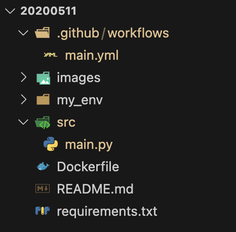
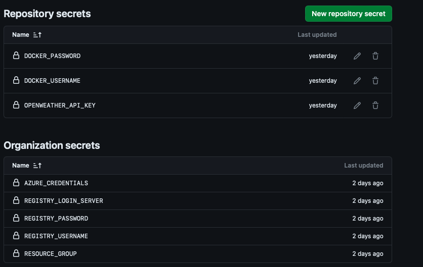
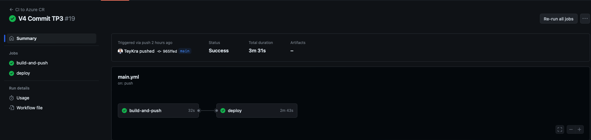
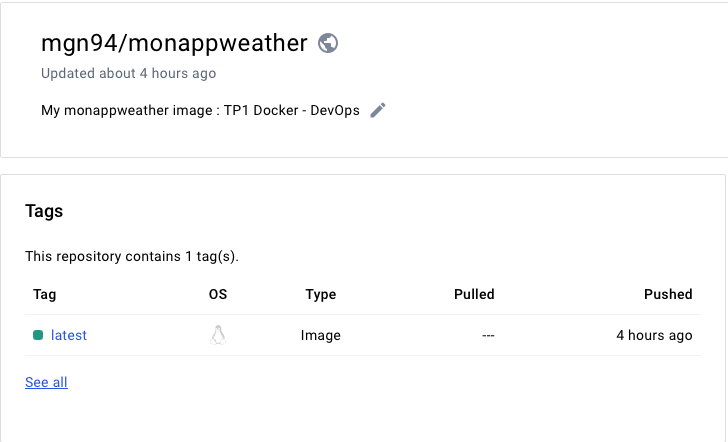
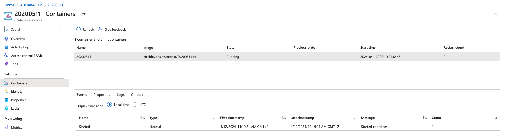

# DEVOPS - TP3: Cloud - ACI

## Objectives

- Make your code available in a Github repository.
- Make your API-formatted image available on Azure Container Registry (ACR) using Github Actions.
- Deploy on Azure Container Instance (ACI) using Github Actions.

## Github Organization Available Secrets

- **AZURE_CREDENTIALS**: Service account for authenticating with Azure API.
- **REGISTRY_LOGIN_SERVER**: Registry link (efreidevops.azurecr.io).
- **REGISTRY_USERNAME**: Username for the registry.
- **REGISTRY_PASSWORD**: Password for the registry.
- **RESOURCE_GROUP**: Azure resource group (ADDA84-CTP).

## Constraints

- **Location**: france central.
- **dns-name-label**: `devops-<identifiant-efrei>`.
- **Use the Github organization and its secrets**.
- **Azure Container Registry**: efreidevops.azurecr.io.
- **ACI Name**: EFREI identifier (example: 11002167).
- **ACR Repository Name**: EFREI identifier (example: efreidevops.azurecr.io/11002167:v1).

## Grading

- Code available on Github.
- Github action that builds and pushes the image to ACR with each new commit.
- Container deployed on Azure Container Instance.
- API that returns the weather using the following command:

```shell
curl "http://devops-<identifiant-efrei>.francecentral.azurecontainer.io/?
lat=5.902785&lon=102.754175"
```

## Bonus

- Use Prometheus libraries ([Prometheus](https://prometheus.io/docs/instrumenting/clientlibs/)) to expose an HTTP `/metrics` endpoint. Use a counter to represent the number of requests processed.

# DevOps API Service Automation Project - Deploying with Docker, GitHub Actions, and Azure

## Introduction

In continuation of deepening DevOps skills, Practical Work #3 is designed to explore advanced features of continuous integration and continuous deployment (CI/CD) through the use of GitHub Actions. The aim of this practical work is to deploy a functional API that interacts with the OpenWeather service to obtain weather information, automating the creation and deployment of its Docker image via GitHub Actions. The code will be hosted in a dedicated GitHub repository, while the API will be encapsulated in a Docker image stored in Azure Container Registry (ACR) to ensure its portability and facilitate deployment. The final image will then be deployed on an Azure Container Instance (ACI), making our work accessible and reusable within the community. This practical work highlights the importance of automation and effective development practices in the current technological landscape, thus reinforcing the fundamental principles of DevOps.

## Architecture

To meet the project's requirements, we will follow the same architecture used in TP2. However, modifications will be made to the workflow for ACR and the Python script `main.py` to implement the `/metrics` endpoint with Prometheus.

### Diagram



## GitHub repository secret



## Code

### Prometheus Implementation

This code snippet integrates Prometheus metrics into a Flask application, aimed at monitoring a simple API. 

#### Importing Necessary Modules

```python
from prometheus_flask_exporter import PrometheusMetrics
```

- **PrometheusMetrics**: This module is imported from the `prometheus_flask_exporter` library, which is used to expose Flask application metrics to Prometheus.

#### Application Setup

```python
app = Flask(__name__)
metrics = PrometheusMetrics(app)
```

- **app**: This initializes a new Flask application instance.
- **metrics**: This line attaches Prometheus metrics to the Flask app.

#### App Information Metric

```python
metrics.info('app_info', 'Weather API', version='1.0.0')
```

- This metric statically registers information about the application, such as the name ('Weather API') and its version ('1.0.0').

#### Request Counter

```python
request_counter = metrics.counter(
    'requests_by_type', 'Number of requests by type',
    labels={'endpoint': 'get_weather'}
)
```

- **request_counter**: This creates a counter metric named `requests_by_type`, which tracks the number of requests by type.
- **labels**: The counter is labeled with `endpoint` having the value `get_weather` to specify that the counts are for requests hitting the `get_weather` endpoint.

### Wrapper (`main.py`)

The rest of the wrapper code is the same as we did on TP2, here is the complete wrapper code with the prometheus implementation. We simply change the port `8081` to `80` and we will see why we make this choice later in the report.

```python
from flask import Flask, request, jsonify
import os
import requests
from prometheus_flask_exporter import PrometheusMetrics

app = Flask(__name__)
metrics = PrometheusMetrics(app)
metrics.info('app_info', 'Weather API', version='1.0.0')

# Compteur pour le nombre de requêtes traitées
request_counter = metrics.counter(
    'requests_by_type', 'Number of requests by type',
    labels={'endpoint': 'get_weather'}
)

# Définir la route racine qui réagira aux requêtes HTTP GET
@app.route('/')
def get_weather():
    # Récupérer les paramètres 'lat' (latitude) et 'lon' (longitude) de la requête HTTP
    latitude = request.args.get('lat')
    longitude = request.args.get('lon')
    # Récupérer la clé API de la variable d'environnement OPENWEATHER_API_KEY
    api_key = os.getenv('OPENWEATHER_API_KEY')

    # Vérifier si tous les paramètres nécessaires sont présents
    if not all([latitude, longitude, api_key]):
        # Si un paramètre est manquant, retourner un message d'erreur et un code de statut HTTP 400 (Bad Request)
        return "Les variables d'environnement LATITUDE, LONGITUDE, et OPENWEATHER_API_KEY sont requises.", 400

    # Définir l'URL de base pour l'API météo OpenWeatherMap
    BASE_URL = "http://api.openweathermap.org/data/2.5/weather"
    # Préparer les paramètres de la requête à envoyer à l'API OpenWeatherMap
    params = {
        'lat': latitude,
        'lon': longitude,
        'appid': api_key,
        'units': 'metric'  # Définir les unités en métrique (Celsius)
    }
    # Faire une requête GET à l'API OpenWeatherMap avec les paramètres spécifiés
    response = requests.get(BASE_URL, params=params)
    
    # Vérifier si la réponse est réussie (code de statut HTTP 200)
    if response.status_code == 200:
        # Convertir la réponse JSON en un dictionnaire Python
        data = response.json()
        # Récupérer la description de la météo et la température de la réponse
        weather_description = data['weather'][0]['description']
        temperature = data['main']['temp']
        # Retourner un JSON contenant les informations météo et un code de statut HTTP 200 (OK)
        return jsonify({
            "city": data['name'],  # Nom de la ville
            "country": data['sys']['country'],  # Code pays
            "weather_description": weather_description,  # Description de la météo
            "temperature": temperature  # Température actuelle
        })
    else:
        # Si la requête échoue, retourner un JSON contenant le message d'erreur et le code de statut HTTP de la réponse
        return jsonify({"error": "Failed to fetch weather data"}), response.status_code

# Point d'entrée du script, cela permet de lancer le serveur uniquement si le script est exécuté directement
if __name__ == '__main__':
    # Démarrer l'application Flask sur le port 80 accessible de l'extérieur
    app.run(host='0.0.0.0', port=80) 
```

### Dockerfile (`Dockerfile`)

In the `Dockerfile` we simply change the execution port of the application: `8081` to `80`:

```dockerfile
# Utiliser une image de base officielle Python Alpine pour minimiser les vulnérabilités
FROM python:3.9-alpine

# Définir le répertoire de travail dans le conteneur
WORKDIR /app

# Installer les dépendances nécessaires pour compiler certains packages de Python
RUN apk add --no-cache build-base=0.5-r3 libffi-dev=3.4.4-r3

# Copier le fichier des dépendances et installer les dépendances
COPY requirements.txt ./
RUN pip install --no-cache-dir -r requirements.txt

# Copier le reste des fichiers du code source de l'application dans le conteneur
COPY src/ ./

# Définir la variable d'environnement pour la clé API 
ENV OPENWEATHER_API_KEY=""
ENV FLASK_APP=main.py

# Commande pour exécuter l'application
CMD ["flask", "run", "--host=0.0.0.0", "--port=80"]
```

### GitHub Action: CI to Azure CR (`main.yml`)

We modified our main.yml for the new TP3 requirements: 
This GitHub Action is designed to automate the process of building a Docker image from the code pushed to the main branch, pushing it to Azure Container Registry (ACR), and then deploying it on Azure Container Instance (ACI). 

#### Workflow Trigger

```yaml
name: CI to Azure CR

on:
  push:
    branches:
      - main
```

- **Trigger**: This workflow is triggered on a push event specifically to the `main` branch of the repository.

#### Jobs

##### 1. Build and Push Image to ACR

```yaml
jobs:
  build-and-push:
    runs-on: ubuntu-latest
    steps:
    - uses: actions/checkout@v2
    - name: Set up Docker Buildx
      uses: docker/setup-buildx-action@v1
    - name: Log in to Azure Container Registry
      uses: docker/login-action@v1
      with:
        registry: ${{ secrets.REGISTRY_LOGIN_SERVER }}
        username: ${{ secrets.REGISTRY_USERNAME }}
        password: ${{ secrets.REGISTRY_PASSWORD }}
    - name: Build and push Docker image to ACR
      uses: docker/build-push-action@v2
      with:
        context: .
        file: ./Dockerfile
        push: true
        tags: ${{ secrets.REGISTRY_LOGIN_SERVER }}/20200511:v1
      env:
        OPENWEATHER_API_KEY: ${{ secrets.OPENWEATHER_API_KEY }}
    - name: Run Hadolint
      uses: hadolint/hadolint-action@v1.6.0
      with:
        dockerfile: Dockerfile
```

- **Environment**: This job runs on the latest Ubuntu runner.
- **Steps**:
  - **Checkout**: Checks out the repository code.
  - **Docker Buildx Setup**: Prepares Docker Buildx to build multi-architecture images.
  - **Docker Login**: Authenticates with Azure Container Registry using secrets configured in the GitHub repository.
  - **Build and Push**: Builds the Docker image from a Dockerfile and pushes it to ACR. The image is tagged with a specific version.
  - **Hadolint**: Links the Dockerfile using Hadolint to ensure best practices are followed.

##### 2. Deploy to Azure Container Instance

```yaml
  deploy:
    needs: build-and-push
    runs-on: ubuntu-latest
    steps:
    - name: Checkout code
      uses: actions/checkout@v2
    - name: 'Login via Azure CLI'
      uses: azure/login@v1
      with:
        creds: ${{ secrets.AZURE_CREDENTIALS }}
    - name: 'Deploy to Azure Container Instance'
      uses: azure/aci-deploy@v1
      with:
        resource-group: ADDA84-CTP
        dns-name-label: devops-20200511
        image: ${{ secrets.REGISTRY_LOGIN_SERVER }}/20200511:v1
        name: 20200511
        location: 'francecentral'
        registry-login-server: ${{ secrets.REGISTRY_LOGIN_SERVER }}
        registry-username: ${{ secrets.REGISTRY_USERNAME }}
        registry-password: ${{ secrets.REGISTRY_PASSWORD }}
        secure-environment-variables: OPENWEATHER_API_KEY=${{ secrets.OPENWEATHER_API_KEY }}
```

- **Dependencies**: This job depends on the successful completion of the `build-and-push` job.
- **Steps**:
  - **Checkout**: Re-checks out the code.
  - **Azure CLI Login**: Logs into Azure using the service principal credentials.
  - **Deploy**: Deploys the Docker image to an Azure Container Instance. The deployment uses details like resource group, DNS name label, and location, among others.

## Requirements File: `requirements.txt`

This file specifies the Python libraries required for the project. Compare to the previous TP, we just add the dependencies for the prometheus library.

### Dependencies

- **Flask**
  - **Purpose**: Flask is a lightweight WSGI web application framework. It is designed to make getting started quick and easy, with the ability to scale up to complex applications.

- **requests**
  - **Purpose**: Requests is an elegant and simple HTTP library for Python, built for human beings. It is used to make HTTP requests simpler and more human-friendly.

- **prometheus_flask_exporter**
  - **Purpose**: This library provides a Prometheus metrics exporter for Flask applications. It makes it easy to track application metrics directly from Flask.


## Output

### Local Execution 

###### Input

```shell
% python main.py
```

##### Output

```shell
 * Serving Flask app 'main'
 * Debug mode: off
WARNING: This is a development server. Do not use it in a production deployment. Use a production WSGI server instead.
 * Running on all addresses (0.0.0.0)
 * Running on http://127.0.0.1:80
 * Running on http://192.168.1.23:80
Press CTRL+C to quit
```

- We launch the main.py script to execute our API
- Now in another terminal, we can use curl to make some request on our API

##### Input

```shell 
curl "http://localhost:80/?lat=40.7128&lon=-74.0060" 
```

##### Output

```shell
{"city":"New York","country":"US","temperature":10.38,"weather_description":"overcast clouds"}
```

##### Input

```shell
curl "http://localhost:80/?lat=-33.8688&lon=151.2093" 
```

##### Output

```shell
{"city":"Sydney","country":"AU","temperature":15.39,"weather_description":"overcast clouds"}
```

##### Input

```shell
curl "http://localhost:80/?lat=35.6895&lon=139.6917" 
```

##### Output

```shell
{"city":"Tokyo","country":"JP","temperature":15,"weather_description":"broken clouds"}
```

### Prometheus metrics 

##### Input

```shell
curl http://127.0.0.1:8081/metrics
```

##### Output

```shell
# HELP python_gc_objects_collected_total Objects collected during gc
# TYPE python_gc_objects_collected_total counter
python_gc_objects_collected_total{generation="0"} 293.0
python_gc_objects_collected_total{generation="1"} 51.0
python_gc_objects_collected_total{generation="2"} 0.0
# HELP python_gc_objects_uncollectable_total Uncollectable objects found during GC
# TYPE python_gc_objects_uncollectable_total counter
python_gc_objects_uncollectable_total{generation="0"} 0.0
python_gc_objects_uncollectable_total{generation="1"} 0.0
python_gc_objects_uncollectable_total{generation="2"} 0.0
# HELP python_gc_collections_total Number of times this generation was collected
# TYPE python_gc_collections_total counter
python_gc_collections_total{generation="0"} 77.0
python_gc_collections_total{generation="1"} 6.0
python_gc_collections_total{generation="2"} 0.0
# HELP python_info Python platform information
# TYPE python_info gauge
python_info{implementation="CPython",major="3",minor="12",patchlevel="2",version="3.12.2"} 1.0
# HELP flask_exporter_info Information about the Prometheus Flask exporter
# TYPE flask_exporter_info gauge
flask_exporter_info{version="0.23.0"} 1.0
# HELP flask_http_request_duration_seconds Flask HTTP request duration in seconds
# TYPE flask_http_request_duration_seconds histogram
flask_http_request_duration_seconds_bucket{le="0.005",method="GET",path="/",status="200"} 0.0
flask_http_request_duration_seconds_bucket{le="0.01",method="GET",path="/",status="200"} 0.0
flask_http_request_duration_seconds_bucket{le="0.025",method="GET",path="/",status="200"} 0.0
flask_http_request_duration_seconds_bucket{le="0.05",method="GET",path="/",status="200"} 1.0
flask_http_request_duration_seconds_bucket{le="0.075",method="GET",path="/",status="200"} 2.0
flask_http_request_duration_seconds_bucket{le="0.1",method="GET",path="/",status="200"} 2.0
flask_http_request_duration_seconds_bucket{le="0.25",method="GET",path="/",status="200"} 3.0
flask_http_request_duration_seconds_bucket{le="0.5",method="GET",path="/",status="200"} 3.0
flask_http_request_duration_seconds_bucket{le="0.75",method="GET",path="/",status="200"} 3.0
flask_http_request_duration_seconds_bucket{le="1.0",method="GET",path="/",status="200"} 3.0
flask_http_request_duration_seconds_bucket{le="2.5",method="GET",path="/",status="200"} 3.0
flask_http_request_duration_seconds_bucket{le="5.0",method="GET",path="/",status="200"} 3.0
flask_http_request_duration_seconds_bucket{le="7.5",method="GET",path="/",status="200"} 3.0
flask_http_request_duration_seconds_bucket{le="10.0",method="GET",path="/",status="200"} 3.0
flask_http_request_duration_seconds_bucket{le="+Inf",method="GET",path="/",status="200"} 3.0
flask_http_request_duration_seconds_count{method="GET",path="/",status="200"} 3.0
flask_http_request_duration_seconds_sum{method="GET",path="/",status="200"} 0.2761303750012303
# HELP flask_http_request_duration_seconds_created Flask HTTP request duration in seconds
# TYPE flask_http_request_duration_seconds_created gauge
flask_http_request_duration_seconds_created{method="GET",path="/",status="200"} 1.712922281742592e+09
# HELP flask_http_request_total Total number of HTTP requests
# TYPE flask_http_request_total counter
flask_http_request_total{method="GET",status="200"} 3.0
# HELP flask_http_request_created Total number of HTTP requests
# TYPE flask_http_request_created gauge
flask_http_request_created{method="GET",status="200"} 1.7129222817427351e+09
# HELP flask_http_request_exceptions_total Total number of HTTP requests which resulted in an exception
# TYPE flask_http_request_exceptions_total counter
# HELP app_info Weather API
# TYPE app_info gauge
app_info{version="1.0.0"} 1.0
# HELP requests_by_type_total Number of requests by type
# TYPE requests_by_type_total counter
requests_by_type_total{endpoint="get_weather"} 0.0
# HELP requests_by_type_created Number of requests by type
# TYPE requests_by_type_created gauge
requests_by_type_created{endpoint="get_weather"} 1.712922256830365e+09
```

The output shows various metrics related to Python and Flask, as well as those specific to our application.

### Analysis of Main Metrics

- **`flask_http_request_total`**: This metric indicates the total number of HTTP requests processed by the application, with their method and status code. For example, `{method="GET",status="200"} 3.0` shows that we had 3 successful GET requests.

- **`flask_http_request_duration_seconds`**: This measures the duration of HTTP requests. Buckets show how many requests fall in each time interval, which is useful for analyzing endpoint performance.

- **`requests_by_type_total`**: Metric to count the number of requests by type, labeled by endpoint.

### Log Creation

```shell
127.0.0.1 - - [12/Apr/2024 13:44:41] "GET /?lat=40.7128&lon=-74.0060 HTTP/1.1" 200 -
127.0.0.1 - - [12/Apr/2024 13:44:53] "GET /?lat=-33.8688&lon=151.2093 HTTP/1.1" 200 -
127.0.0.1 - - [12/Apr/2024 13:45:04] "GET /?lat=35.6895&lon=139.6917 HTTP/1.1" 200 -
127.0.0.1 - - [12/Apr/2024 13:46:39] "GET /metrics HTTP/1.1" 200 -
```

- We can see log creation when we query our API

### GitHub Action AND Azur execution

### GitHub Action

- When we push our projet on our repository on github, the GitHub action start to build and push the last version of our image on DockerHub and Azure Container Registry.



- Here we can see that the build is completed. So now we can check if have an update on our Docker Hub and Azure Resource Group.

### DockerHub



- We can see that our image on DockerHub updated because of the new push of our project on our GitHub Repository.

### Azure Container Registry



- We can see that our resource has been uploaded to our resource group. This is implemented for use with curl for example.

### Cloud Request

Now, if we want to use our API from the image sent to the Azure cloud, we can use curl to do this:

#### Test the API Endpoint

##### Input

```shell
curl http://devops-20200511.francecentral.azurecontainer.io/
```

##### Output

```shell
Les variables d'environnement LATITUDE, LONGITUDE, et OPENWEATHER_API_KEY sont requises.
```

#### Test with Parameters

##### Input

```shell
curl "http://devops-20200511.francecentral.azurecontainer.io/?lat=48.8566&lon=2.3522"
```

##### Output

```shell
{"city":"Paris","country":"FR","temperature":21.49,"weather_description":"few clouds"}
```

#### Check Prometheus Metrics

##### Input

```shell
curl http://devops-20200511.francecentral.azurecontainer.io/metrics
```

##### Output

```shell
# HELP python_gc_objects_collected_total Objects collected during gc
# TYPE python_gc_objects_collected_total counter
python_gc_objects_collected_total{generation="0"} 2867.0
python_gc_objects_collected_total{generation="1"} 18.0
python_gc_objects_collected_total{generation="2"} 0.0
# HELP python_gc_objects_uncollectable_total Uncollectable objects found during GC
# TYPE python_gc_objects_uncollectable_total counter
python_gc_objects_uncollectable_total{generation="0"} 0.0
python_gc_objects_uncollectable_total{generation="1"} 0.0
python_gc_objects_uncollectable_total{generation="2"} 0.0
# HELP python_gc_collections_total Number of times this generation was collected
# TYPE python_gc_collections_total counter
python_gc_collections_total{generation="0"} 94.0
python_gc_collections_total{generation="1"} 8.0
python_gc_collections_total{generation="2"} 0.0
# HELP python_info Python platform information
# TYPE python_info gauge
python_info{implementation="CPython",major="3",minor="9",patchlevel="19",version="3.9.19"} 1.0
# HELP process_virtual_memory_bytes Virtual memory size in bytes.
# TYPE process_virtual_memory_bytes gauge
process_virtual_memory_bytes 3.8088704e+07
# HELP process_resident_memory_bytes Resident memory size in bytes.
# TYPE process_resident_memory_bytes gauge
process_resident_memory_bytes 3.0593024e+07
# HELP process_start_time_seconds Start time of the process since unix epoch in seconds.
# TYPE process_start_time_seconds gauge
process_start_time_seconds 1.71291356133e+09
# HELP process_cpu_seconds_total Total user and system CPU time spent in seconds.
# TYPE process_cpu_seconds_total counter
process_cpu_seconds_total 3.93
# HELP process_open_fds Number of open file descriptors.
# TYPE process_open_fds gauge
process_open_fds 8.0
# HELP process_max_fds Maximum number of open file descriptors.
# TYPE process_max_fds gauge
process_max_fds 1024.0
# HELP flask_exporter_info Information about the Prometheus Flask exporter
# TYPE flask_exporter_info gauge
flask_exporter_info{version="0.23.0"} 1.0
# HELP flask_http_request_duration_seconds Flask HTTP request duration in seconds
# TYPE flask_http_request_duration_seconds histogram
flask_http_request_duration_seconds_bucket{le="0.005",method="GET",path="/",status="400"} 13.0
flask_http_request_duration_seconds_bucket{le="0.01",method="GET",path="/",status="400"} 13.0
flask_http_request_duration_seconds_bucket{le="0.025",method="GET",path="/",status="400"} 13.0
flask_http_request_duration_seconds_bucket{le="0.05",method="GET",path="/",status="400"} 13.0
flask_http_request_duration_seconds_bucket{le="0.075",method="GET",path="/",status="400"} 13.0
flask_http_request_duration_seconds_bucket{le="0.1",method="GET",path="/",status="400"} 13.0
flask_http_request_duration_seconds_bucket{le="0.25",method="GET",path="/",status="400"} 13.0
flask_http_request_duration_seconds_bucket{le="0.5",method="GET",path="/",status="400"} 13.0
flask_http_request_duration_seconds_bucket{le="0.75",method="GET",path="/",status="400"} 13.0
flask_http_request_duration_seconds_bucket{le="1.0",method="GET",path="/",status="400"} 13.0
flask_http_request_duration_seconds_bucket{le="2.5",method="GET",path="/",status="400"} 13.0
flask_http_request_duration_seconds_bucket{le="5.0",method="GET",path="/",status="400"} 13.0
flask_http_request_duration_seconds_bucket{le="7.5",method="GET",path="/",status="400"} 13.0
flask_http_request_duration_seconds_bucket{le="10.0",method="GET",path="/",status="400"} 13.0
flask_http_request_duration_seconds_bucket{le="+Inf",method="GET",path="/",status="400"} 13.0
flask_http_request_duration_seconds_count{method="GET",path="/",status="400"} 13.0
flask_http_request_duration_seconds_sum{method="GET",path="/",status="400"} 0.003387813999552236
flask_http_request_duration_seconds_bucket{le="0.005",method="GET",path="/",status="200"} 0.0
flask_http_request_duration_seconds_bucket{le="0.01",method="GET",path="/",status="200"} 0.0
flask_http_request_duration_seconds_bucket{le="0.025",method="GET",path="/",status="200"} 0.0
flask_http_request_duration_seconds_bucket{le="0.05",method="GET",path="/",status="200"} 0.0
flask_http_request_duration_seconds_bucket{le="0.075",method="GET",path="/",status="200"} 2.0
flask_http_request_duration_seconds_bucket{le="0.1",method="GET",path="/",status="200"} 2.0
flask_http_request_duration_seconds_bucket{le="0.25",method="GET",path="/",status="200"} 2.0
flask_http_request_duration_seconds_bucket{le="0.5",method="GET",path="/",status="200"} 2.0
flask_http_request_duration_seconds_bucket{le="0.75",method="GET",path="/",status="200"} 2.0
flask_http_request_duration_seconds_bucket{le="1.0",method="GET",path="/",status="200"} 2.0
flask_http_request_duration_seconds_bucket{le="2.5",method="GET",path="/",status="200"} 2.0
flask_http_request_duration_seconds_bucket{le="5.0",method="GET",path="/",status="200"} 2.0
flask_http_request_duration_seconds_bucket{le="7.5",method="GET",path="/",status="200"} 2.0
flask_http_request_duration_seconds_bucket{le="10.0",method="GET",path="/",status="200"} 2.0
flask_http_request_duration_seconds_bucket{le="+Inf",method="GET",path="/",status="200"} 2.0
flask_http_request_duration_seconds_count{method="GET",path="/",status="200"} 2.0
flask_http_request_duration_seconds_sum{method="GET",path="/",status="200"} 0.12373941000129207
flask_http_request_duration_seconds_bucket{le="0.005",method="GET",path="/zabbix/favicon.ico",status="404"} 1.0
flask_http_request_duration_seconds_bucket{le="0.01",method="GET",path="/zabbix/favicon.ico",status="404"} 1.0
flask_http_request_duration_seconds_bucket{le="0.025",method="GET",path="/zabbix/favicon.ico",status="404"} 1.0
flask_http_request_duration_seconds_bucket{le="0.05",method="GET",path="/zabbix/favicon.ico",status="404"} 1.0
flask_http_request_duration_seconds_bucket{le="0.075",method="GET",path="/zabbix/favicon.ico",status="404"} 1.0
flask_http_request_duration_seconds_bucket{le="0.1",method="GET",path="/zabbix/favicon.ico",status="404"} 1.0
flask_http_request_duration_seconds_bucket{le="0.25",method="GET",path="/zabbix/favicon.ico",status="404"} 1.0
flask_http_request_duration_seconds_bucket{le="0.5",method="GET",path="/zabbix/favicon.ico",status="404"} 1.0
flask_http_request_duration_seconds_bucket{le="0.75",method="GET",path="/zabbix/favicon.ico",status="404"} 1.0
flask_http_request_duration_seconds_bucket{le="1.0",method="GET",path="/zabbix/favicon.ico",status="404"} 1.0
flask_http_request_duration_seconds_bucket{le="2.5",method="GET",path="/zabbix/favicon.ico",status="404"} 1.0
flask_http_request_duration_seconds_bucket{le="5.0",method="GET",path="/zabbix/favicon.ico",status="404"} 1.0
flask_http_request_duration_seconds_bucket{le="7.5",method="GET",path="/zabbix/favicon.ico",status="404"} 1.0
flask_http_request_duration_seconds_bucket{le="10.0",method="GET",path="/zabbix/favicon.ico",status="404"} 1.0
flask_http_request_duration_seconds_bucket{le="+Inf",method="GET",path="/zabbix/favicon.ico",status="404"} 1.0
flask_http_request_duration_seconds_count{method="GET",path="/zabbix/favicon.ico",status="404"} 1.0
flask_http_request_duration_seconds_sum{method="GET",path="/zabbix/favicon.ico",status="404"} 0.00039270100000976527
flask_http_request_duration_seconds_bucket{le="0.005",method="GET",path="/favicon.ico",status="404"} 2.0
flask_http_request_duration_seconds_bucket{le="0.01",method="GET",path="/favicon.ico",status="404"} 2.0
flask_http_request_duration_seconds_bucket{le="0.025",method="GET",path="/favicon.ico",status="404"} 2.0
flask_http_request_duration_seconds_bucket{le="0.05",method="GET",path="/favicon.ico",status="404"} 2.0
flask_http_request_duration_seconds_bucket{le="0.075",method="GET",path="/favicon.ico",status="404"} 2.0
flask_http_request_duration_seconds_bucket{le="0.1",method="GET",path="/favicon.ico",status="404"} 2.0
flask_http_request_duration_seconds_bucket{le="0.25",method="GET",path="/favicon.ico",status="404"} 2.0
flask_http_request_duration_seconds_bucket{le="0.5",method="GET",path="/favicon.ico",status="404"} 2.0
flask_http_request_duration_seconds_bucket{le="0.75",method="GET",path="/favicon.ico",status="404"} 2.0
flask_http_request_duration_seconds_bucket{le="1.0",method="GET",path="/favicon.ico",status="404"} 2.0
flask_http_request_duration_seconds_bucket{le="2.5",method="GET",path="/favicon.ico",status="404"} 2.0
flask_http_request_duration_seconds_bucket{le="5.0",method="GET",path="/favicon.ico",status="404"} 2.0
flask_http_request_duration_seconds_bucket{le="7.5",method="GET",path="/favicon.ico",status="404"} 2.0
flask_http_request_duration_seconds_bucket{le="10.0",method="GET",path="/favicon.ico",status="404"} 2.0
flask_http_request_duration_seconds_bucket{le="+Inf",method="GET",path="/favicon.ico",status="404"} 2.0
flask_http_request_duration_seconds_count{method="GET",path="/favicon.ico",status="404"} 2.0
flask_http_request_duration_seconds_sum{method="GET",path="/favicon.ico",status="404"} 0.0006893039999340544
flask_http_request_duration_seconds_bucket{le="0.005",method="GET",path="/cgi-bin/authLogin.cgi",status="404"} 1.0
flask_http_request_duration_seconds_bucket{le="0.01",method="GET",path="/cgi-bin/authLogin.cgi",status="404"} 1.0
flask_http_request_duration_seconds_bucket{le="0.025",method="GET",path="/cgi-bin/authLogin.cgi",status="404"} 1.0
flask_http_request_duration_seconds_bucket{le="0.05",method="GET",path="/cgi-bin/authLogin.cgi",status="404"} 1.0
flask_http_request_duration_seconds_bucket{le="0.075",method="GET",path="/cgi-bin/authLogin.cgi",status="404"} 1.0
flask_http_request_duration_seconds_bucket{le="0.1",method="GET",path="/cgi-bin/authLogin.cgi",status="404"} 1.0
flask_http_request_duration_seconds_bucket{le="0.25",method="GET",path="/cgi-bin/authLogin.cgi",status="404"} 1.0
flask_http_request_duration_seconds_bucket{le="0.5",method="GET",path="/cgi-bin/authLogin.cgi",status="404"} 1.0
flask_http_request_duration_seconds_bucket{le="0.75",method="GET",path="/cgi-bin/authLogin.cgi",status="404"} 1.0
flask_http_request_duration_seconds_bucket{le="1.0",method="GET",path="/cgi-bin/authLogin.cgi",status="404"} 1.0
flask_http_request_duration_seconds_bucket{le="2.5",method="GET",path="/cgi-bin/authLogin.cgi",status="404"} 1.0
flask_http_request_duration_seconds_bucket{le="5.0",method="GET",path="/cgi-bin/authLogin.cgi",status="404"} 1.0
flask_http_request_duration_seconds_bucket{le="7.5",method="GET",path="/cgi-bin/authLogin.cgi",status="404"} 1.0
flask_http_request_duration_seconds_bucket{le="10.0",method="GET",path="/cgi-bin/authLogin.cgi",status="404"} 1.0
flask_http_request_duration_seconds_bucket{le="+Inf",method="GET",path="/cgi-bin/authLogin.cgi",status="404"} 1.0
flask_http_request_duration_seconds_count{method="GET",path="/cgi-bin/authLogin.cgi",status="404"} 1.0
flask_http_request_duration_seconds_sum{method="GET",path="/cgi-bin/authLogin.cgi",status="404"} 0.0010846049999599927
flask_http_request_duration_seconds_bucket{le="0.005",method="GET",path="/showLogin.cc",status="404"} 1.0
flask_http_request_duration_seconds_bucket{le="0.01",method="GET",path="/showLogin.cc",status="404"} 1.0
flask_http_request_duration_seconds_bucket{le="0.025",method="GET",path="/showLogin.cc",status="404"} 1.0
flask_http_request_duration_seconds_bucket{le="0.05",method="GET",path="/showLogin.cc",status="404"} 1.0
flask_http_request_duration_seconds_bucket{le="0.075",method="GET",path="/showLogin.cc",status="404"} 1.0
flask_http_request_duration_seconds_bucket{le="0.1",method="GET",path="/showLogin.cc",status="404"} 1.0
flask_http_request_duration_seconds_bucket{le="0.25",method="GET",path="/showLogin.cc",status="404"} 1.0
flask_http_request_duration_seconds_bucket{le="0.5",method="GET",path="/showLogin.cc",status="404"} 1.0
flask_http_request_duration_seconds_bucket{le="0.75",method="GET",path="/showLogin.cc",status="404"} 1.0
flask_http_request_duration_seconds_bucket{le="1.0",method="GET",path="/showLogin.cc",status="404"} 1.0
flask_http_request_duration_seconds_bucket{le="2.5",method="GET",path="/showLogin.cc",status="404"} 1.0
flask_http_request_duration_seconds_bucket{le="5.0",method="GET",path="/showLogin.cc",status="404"} 1.0
flask_http_request_duration_seconds_bucket{le="7.5",method="GET",path="/showLogin.cc",status="404"} 1.0
flask_http_request_duration_seconds_bucket{le="10.0",method="GET",path="/showLogin.cc",status="404"} 1.0
flask_http_request_duration_seconds_bucket{le="+Inf",method="GET",path="/showLogin.cc",status="404"} 1.0
flask_http_request_duration_seconds_count{method="GET",path="/showLogin.cc",status="404"} 1.0
flask_http_request_duration_seconds_sum{method="GET",path="/showLogin.cc",status="404"} 0.0005332020000423654
flask_http_request_duration_seconds_bucket{le="0.005",method="GET",path="/identity",status="404"} 1.0
flask_http_request_duration_seconds_bucket{le="0.01",method="GET",path="/identity",status="404"} 1.0
flask_http_request_duration_seconds_bucket{le="0.025",method="GET",path="/identity",status="404"} 1.0
flask_http_request_duration_seconds_bucket{le="0.05",method="GET",path="/identity",status="404"} 1.0
flask_http_request_duration_seconds_bucket{le="0.075",method="GET",path="/identity",status="404"} 1.0
flask_http_request_duration_seconds_bucket{le="0.1",method="GET",path="/identity",status="404"} 1.0
flask_http_request_duration_seconds_bucket{le="0.25",method="GET",path="/identity",status="404"} 1.0
flask_http_request_duration_seconds_bucket{le="0.5",method="GET",path="/identity",status="404"} 1.0
flask_http_request_duration_seconds_bucket{le="0.75",method="GET",path="/identity",status="404"} 1.0
flask_http_request_duration_seconds_bucket{le="1.0",method="GET",path="/identity",status="404"} 1.0
flask_http_request_duration_seconds_bucket{le="2.5",method="GET",path="/identity",status="404"} 1.0
flask_http_request_duration_seconds_bucket{le="5.0",method="GET",path="/identity",status="404"} 1.0
flask_http_request_duration_seconds_bucket{le="7.5",method="GET",path="/identity",status="404"} 1.0
flask_http_request_duration_seconds_bucket{le="10.0",method="GET",path="/identity",status="404"} 1.0
flask_http_request_duration_seconds_bucket{le="+Inf",method="GET",path="/identity",status="404"} 1.0
flask_http_request_duration_seconds_count{method="GET",path="/identity",status="404"} 1.0
flask_http_request_duration_seconds_sum{method="GET",path="/identity",status="404"} 0.00031100199998945754
flask_http_request_duration_seconds_bucket{le="0.005",method="GET",path="/solr/",status="404"} 1.0
flask_http_request_duration_seconds_bucket{le="0.01",method="GET",path="/solr/",status="404"} 1.0
flask_http_request_duration_seconds_bucket{le="0.025",method="GET",path="/solr/",status="404"} 1.0
flask_http_request_duration_seconds_bucket{le="0.05",method="GET",path="/solr/",status="404"} 1.0
flask_http_request_duration_seconds_bucket{le="0.075",method="GET",path="/solr/",status="404"} 1.0
flask_http_request_duration_seconds_bucket{le="0.1",method="GET",path="/solr/",status="404"} 1.0
flask_http_request_duration_seconds_bucket{le="0.25",method="GET",path="/solr/",status="404"} 1.0
flask_http_request_duration_seconds_bucket{le="0.5",method="GET",path="/solr/",status="404"} 1.0
flask_http_request_duration_seconds_bucket{le="0.75",method="GET",path="/solr/",status="404"} 1.0
flask_http_request_duration_seconds_bucket{le="1.0",method="GET",path="/solr/",status="404"} 1.0
flask_http_request_duration_seconds_bucket{le="2.5",method="GET",path="/solr/",status="404"} 1.0
flask_http_request_duration_seconds_bucket{le="5.0",method="GET",path="/solr/",status="404"} 1.0
flask_http_request_duration_seconds_bucket{le="7.5",method="GET",path="/solr/",status="404"} 1.0
flask_http_request_duration_seconds_bucket{le="10.0",method="GET",path="/solr/",status="404"} 1.0
flask_http_request_duration_seconds_bucket{le="+Inf",method="GET",path="/solr/",status="404"} 1.0
flask_http_request_duration_seconds_count{method="GET",path="/solr/",status="404"} 1.0
flask_http_request_duration_seconds_sum{method="GET",path="/solr/",status="404"} 0.0003087009999944712
flask_http_request_duration_seconds_bucket{le="0.005",method="GET",path="/js/NewWindow_2_all.js",status="404"} 1.0
flask_http_request_duration_seconds_bucket{le="0.01",method="GET",path="/js/NewWindow_2_all.js",status="404"} 1.0
flask_http_request_duration_seconds_bucket{le="0.025",method="GET",path="/js/NewWindow_2_all.js",status="404"} 1.0
flask_http_request_duration_seconds_bucket{le="0.05",method="GET",path="/js/NewWindow_2_all.js",status="404"} 1.0
flask_http_request_duration_seconds_bucket{le="0.075",method="GET",path="/js/NewWindow_2_all.js",status="404"} 1.0
flask_http_request_duration_seconds_bucket{le="0.1",method="GET",path="/js/NewWindow_2_all.js",status="404"} 1.0
flask_http_request_duration_seconds_bucket{le="0.25",method="GET",path="/js/NewWindow_2_all.js",status="404"} 1.0
flask_http_request_duration_seconds_bucket{le="0.5",method="GET",path="/js/NewWindow_2_all.js",status="404"} 1.0
flask_http_request_duration_seconds_bucket{le="0.75",method="GET",path="/js/NewWindow_2_all.js",status="404"} 1.0
flask_http_request_duration_seconds_bucket{le="1.0",method="GET",path="/js/NewWindow_2_all.js",status="404"} 1.0
flask_http_request_duration_seconds_bucket{le="2.5",method="GET",path="/js/NewWindow_2_all.js",status="404"} 1.0
flask_http_request_duration_seconds_bucket{le="5.0",method="GET",path="/js/NewWindow_2_all.js",status="404"} 1.0
flask_http_request_duration_seconds_bucket{le="7.5",method="GET",path="/js/NewWindow_2_all.js",status="404"} 1.0
flask_http_request_duration_seconds_bucket{le="10.0",method="GET",path="/js/NewWindow_2_all.js",status="404"} 1.0
flask_http_request_duration_seconds_bucket{le="+Inf",method="GET",path="/js/NewWindow_2_all.js",status="404"} 1.0
flask_http_request_duration_seconds_count{method="GET",path="/js/NewWindow_2_all.js",status="404"} 1.0
flask_http_request_duration_seconds_sum{method="GET",path="/js/NewWindow_2_all.js",status="404"} 0.00028190099988023576
flask_http_request_duration_seconds_bucket{le="0.005",method="GET",path="/Telerik.Web.UI.WebResource.axd",status="404"} 1.0
flask_http_request_duration_seconds_bucket{le="0.01",method="GET",path="/Telerik.Web.UI.WebResource.axd",status="404"} 1.0
flask_http_request_duration_seconds_bucket{le="0.025",method="GET",path="/Telerik.Web.UI.WebResource.axd",status="404"} 1.0
flask_http_request_duration_seconds_bucket{le="0.05",method="GET",path="/Telerik.Web.UI.WebResource.axd",status="404"} 1.0
flask_http_request_duration_seconds_bucket{le="0.075",method="GET",path="/Telerik.Web.UI.WebResource.axd",status="404"} 1.0
flask_http_request_duration_seconds_bucket{le="0.1",method="GET",path="/Telerik.Web.UI.WebResource.axd",status="404"} 1.0
flask_http_request_duration_seconds_bucket{le="0.25",method="GET",path="/Telerik.Web.UI.WebResource.axd",status="404"} 1.0
flask_http_request_duration_seconds_bucket{le="0.5",method="GET",path="/Telerik.Web.UI.WebResource.axd",status="404"} 1.0
flask_http_request_duration_seconds_bucket{le="0.75",method="GET",path="/Telerik.Web.UI.WebResource.axd",status="404"} 1.0
flask_http_request_duration_seconds_bucket{le="1.0",method="GET",path="/Telerik.Web.UI.WebResource.axd",status="404"} 1.0
flask_http_request_duration_seconds_bucket{le="2.5",method="GET",path="/Telerik.Web.UI.WebResource.axd",status="404"} 1.0
flask_http_request_duration_seconds_bucket{le="5.0",method="GET",path="/Telerik.Web.UI.WebResource.axd",status="404"} 1.0
flask_http_request_duration_seconds_bucket{le="7.5",method="GET",path="/Telerik.Web.UI.WebResource.axd",status="404"} 1.0
flask_http_request_duration_seconds_bucket{le="10.0",method="GET",path="/Telerik.Web.UI.WebResource.axd",status="404"} 1.0
flask_http_request_duration_seconds_bucket{le="+Inf",method="GET",path="/Telerik.Web.UI.WebResource.axd",status="404"} 1.0
flask_http_request_duration_seconds_count{method="GET",path="/Telerik.Web.UI.WebResource.axd",status="404"} 1.0
flask_http_request_duration_seconds_sum{method="GET",path="/Telerik.Web.UI.WebResource.axd",status="404"} 0.00029700100003537955
flask_http_request_duration_seconds_bucket{le="0.005",method="GET",path="/cf_scripts/scripts/ajax/ckeditor/ckeditor.js",status="404"} 1.0
flask_http_request_duration_seconds_bucket{le="0.01",method="GET",path="/cf_scripts/scripts/ajax/ckeditor/ckeditor.js",status="404"} 1.0
flask_http_request_duration_seconds_bucket{le="0.025",method="GET",path="/cf_scripts/scripts/ajax/ckeditor/ckeditor.js",status="404"} 1.0
flask_http_request_duration_seconds_bucket{le="0.05",method="GET",path="/cf_scripts/scripts/ajax/ckeditor/ckeditor.js",status="404"} 1.0
flask_http_request_duration_seconds_bucket{le="0.075",method="GET",path="/cf_scripts/scripts/ajax/ckeditor/ckeditor.js",status="404"} 1.0
flask_http_request_duration_seconds_bucket{le="0.1",method="GET",path="/cf_scripts/scripts/ajax/ckeditor/ckeditor.js",status="404"} 1.0
flask_http_request_duration_seconds_bucket{le="0.25",method="GET",path="/cf_scripts/scripts/ajax/ckeditor/ckeditor.js",status="404"} 1.0
flask_http_request_duration_seconds_bucket{le="0.5",method="GET",path="/cf_scripts/scripts/ajax/ckeditor/ckeditor.js",status="404"} 1.0
flask_http_request_duration_seconds_bucket{le="0.75",method="GET",path="/cf_scripts/scripts/ajax/ckeditor/ckeditor.js",status="404"} 1.0
flask_http_request_duration_seconds_bucket{le="1.0",method="GET",path="/cf_scripts/scripts/ajax/ckeditor/ckeditor.js",status="404"} 1.0
flask_http_request_duration_seconds_bucket{le="2.5",method="GET",path="/cf_scripts/scripts/ajax/ckeditor/ckeditor.js",status="404"} 1.0
flask_http_request_duration_seconds_bucket{le="5.0",method="GET",path="/cf_scripts/scripts/ajax/ckeditor/ckeditor.js",status="404"} 1.0
flask_http_request_duration_seconds_bucket{le="7.5",method="GET",path="/cf_scripts/scripts/ajax/ckeditor/ckeditor.js",status="404"} 1.0
flask_http_request_duration_seconds_bucket{le="10.0",method="GET",path="/cf_scripts/scripts/ajax/ckeditor/ckeditor.js",status="404"} 1.0
flask_http_request_duration_seconds_bucket{le="+Inf",method="GET",path="/cf_scripts/scripts/ajax/ckeditor/ckeditor.js",status="404"} 1.0
flask_http_request_duration_seconds_count{method="GET",path="/cf_scripts/scripts/ajax/ckeditor/ckeditor.js",status="404"} 1.0
flask_http_request_duration_seconds_sum{method="GET",path="/cf_scripts/scripts/ajax/ckeditor/ckeditor.js",status="404"} 0.0002696019998893462
flask_http_request_duration_seconds_bucket{le="0.005",method="GET",path="/api/session/properties",status="404"} 1.0
flask_http_request_duration_seconds_bucket{le="0.01",method="GET",path="/api/session/properties",status="404"} 1.0
flask_http_request_duration_seconds_bucket{le="0.025",method="GET",path="/api/session/properties",status="404"} 1.0
flask_http_request_duration_seconds_bucket{le="0.05",method="GET",path="/api/session/properties",status="404"} 1.0
flask_http_request_duration_seconds_bucket{le="0.075",method="GET",path="/api/session/properties",status="404"} 1.0
flask_http_request_duration_seconds_bucket{le="0.1",method="GET",path="/api/session/properties",status="404"} 1.0
flask_http_request_duration_seconds_bucket{le="0.25",method="GET",path="/api/session/properties",status="404"} 1.0
flask_http_request_duration_seconds_bucket{le="0.5",method="GET",path="/api/session/properties",status="404"} 1.0
flask_http_request_duration_seconds_bucket{le="0.75",method="GET",path="/api/session/properties",status="404"} 1.0
flask_http_request_duration_seconds_bucket{le="1.0",method="GET",path="/api/session/properties",status="404"} 1.0
flask_http_request_duration_seconds_bucket{le="2.5",method="GET",path="/api/session/properties",status="404"} 1.0
flask_http_request_duration_seconds_bucket{le="5.0",method="GET",path="/api/session/properties",status="404"} 1.0
flask_http_request_duration_seconds_bucket{le="7.5",method="GET",path="/api/session/properties",status="404"} 1.0
flask_http_request_duration_seconds_bucket{le="10.0",method="GET",path="/api/session/properties",status="404"} 1.0
flask_http_request_duration_seconds_bucket{le="+Inf",method="GET",path="/api/session/properties",status="404"} 1.0
flask_http_request_duration_seconds_count{method="GET",path="/api/session/properties",status="404"} 1.0
flask_http_request_duration_seconds_sum{method="GET",path="/api/session/properties",status="404"} 0.00034680199996728334
flask_http_request_duration_seconds_bucket{le="0.005",method="GET",path="/admin/",status="404"} 1.0
flask_http_request_duration_seconds_bucket{le="0.01",method="GET",path="/admin/",status="404"} 1.0
flask_http_request_duration_seconds_bucket{le="0.025",method="GET",path="/admin/",status="404"} 1.0
flask_http_request_duration_seconds_bucket{le="0.05",method="GET",path="/admin/",status="404"} 1.0
flask_http_request_duration_seconds_bucket{le="0.075",method="GET",path="/admin/",status="404"} 1.0
flask_http_request_duration_seconds_bucket{le="0.1",method="GET",path="/admin/",status="404"} 1.0
flask_http_request_duration_seconds_bucket{le="0.25",method="GET",path="/admin/",status="404"} 1.0
flask_http_request_duration_seconds_bucket{le="0.5",method="GET",path="/admin/",status="404"} 1.0
flask_http_request_duration_seconds_bucket{le="0.75",method="GET",path="/admin/",status="404"} 1.0
flask_http_request_duration_seconds_bucket{le="1.0",method="GET",path="/admin/",status="404"} 1.0
flask_http_request_duration_seconds_bucket{le="2.5",method="GET",path="/admin/",status="404"} 1.0
flask_http_request_duration_seconds_bucket{le="5.0",method="GET",path="/admin/",status="404"} 1.0
flask_http_request_duration_seconds_bucket{le="7.5",method="GET",path="/admin/",status="404"} 1.0
flask_http_request_duration_seconds_bucket{le="10.0",method="GET",path="/admin/",status="404"} 1.0
flask_http_request_duration_seconds_bucket{le="+Inf",method="GET",path="/admin/",status="404"} 1.0
flask_http_request_duration_seconds_count{method="GET",path="/admin/",status="404"} 1.0
flask_http_request_duration_seconds_sum{method="GET",path="/admin/",status="404"} 0.00026210099986201385
flask_http_request_duration_seconds_bucket{le="0.005",method="GET",path="/sugar_version.json",status="404"} 1.0
flask_http_request_duration_seconds_bucket{le="0.01",method="GET",path="/sugar_version.json",status="404"} 1.0
flask_http_request_duration_seconds_bucket{le="0.025",method="GET",path="/sugar_version.json",status="404"} 1.0
flask_http_request_duration_seconds_bucket{le="0.05",method="GET",path="/sugar_version.json",status="404"} 1.0
flask_http_request_duration_seconds_bucket{le="0.075",method="GET",path="/sugar_version.json",status="404"} 1.0
flask_http_request_duration_seconds_bucket{le="0.1",method="GET",path="/sugar_version.json",status="404"} 1.0
flask_http_request_duration_seconds_bucket{le="0.25",method="GET",path="/sugar_version.json",status="404"} 1.0
flask_http_request_duration_seconds_bucket{le="0.5",method="GET",path="/sugar_version.json",status="404"} 1.0
flask_http_request_duration_seconds_bucket{le="0.75",method="GET",path="/sugar_version.json",status="404"} 1.0
flask_http_request_duration_seconds_bucket{le="1.0",method="GET",path="/sugar_version.json",status="404"} 1.0
flask_http_request_duration_seconds_bucket{le="2.5",method="GET",path="/sugar_version.json",status="404"} 1.0
flask_http_request_duration_seconds_bucket{le="5.0",method="GET",path="/sugar_version.json",status="404"} 1.0
flask_http_request_duration_seconds_bucket{le="7.5",method="GET",path="/sugar_version.json",status="404"} 1.0
flask_http_request_duration_seconds_bucket{le="10.0",method="GET",path="/sugar_version.json",status="404"} 1.0
flask_http_request_duration_seconds_bucket{le="+Inf",method="GET",path="/sugar_version.json",status="404"} 1.0
flask_http_request_duration_seconds_count{method="GET",path="/sugar_version.json",status="404"} 1.0
flask_http_request_duration_seconds_sum{method="GET",path="/sugar_version.json",status="404"} 0.00035210199985158397
flask_http_request_duration_seconds_bucket{le="0.005",method="GET",path="/sitecore/shell/sitecore.version.xml",status="404"} 1.0
flask_http_request_duration_seconds_bucket{le="0.01",method="GET",path="/sitecore/shell/sitecore.version.xml",status="404"} 1.0
flask_http_request_duration_seconds_bucket{le="0.025",method="GET",path="/sitecore/shell/sitecore.version.xml",status="404"} 1.0
flask_http_request_duration_seconds_bucket{le="0.05",method="GET",path="/sitecore/shell/sitecore.version.xml",status="404"} 1.0
flask_http_request_duration_seconds_bucket{le="0.075",method="GET",path="/sitecore/shell/sitecore.version.xml",status="404"} 1.0
flask_http_request_duration_seconds_bucket{le="0.1",method="GET",path="/sitecore/shell/sitecore.version.xml",status="404"} 1.0
flask_http_request_duration_seconds_bucket{le="0.25",method="GET",path="/sitecore/shell/sitecore.version.xml",status="404"} 1.0
flask_http_request_duration_seconds_bucket{le="0.5",method="GET",path="/sitecore/shell/sitecore.version.xml",status="404"} 1.0
flask_http_request_duration_seconds_bucket{le="0.75",method="GET",path="/sitecore/shell/sitecore.version.xml",status="404"} 1.0
flask_http_request_duration_seconds_bucket{le="1.0",method="GET",path="/sitecore/shell/sitecore.version.xml",status="404"} 1.0
flask_http_request_duration_seconds_bucket{le="2.5",method="GET",path="/sitecore/shell/sitecore.version.xml",status="404"} 1.0
flask_http_request_duration_seconds_bucket{le="5.0",method="GET",path="/sitecore/shell/sitecore.version.xml",status="404"} 1.0
flask_http_request_duration_seconds_bucket{le="7.5",method="GET",path="/sitecore/shell/sitecore.version.xml",status="404"} 1.0
flask_http_request_duration_seconds_bucket{le="10.0",method="GET",path="/sitecore/shell/sitecore.version.xml",status="404"} 1.0
flask_http_request_duration_seconds_bucket{le="+Inf",method="GET",path="/sitecore/shell/sitecore.version.xml",status="404"} 1.0
flask_http_request_duration_seconds_count{method="GET",path="/sitecore/shell/sitecore.version.xml",status="404"} 1.0
flask_http_request_duration_seconds_sum{method="GET",path="/sitecore/shell/sitecore.version.xml",status="404"} 0.00027040099985242705
flask_http_request_duration_seconds_bucket{le="0.005",method="GET",path="/index.jsp",status="404"} 1.0
flask_http_request_duration_seconds_bucket{le="0.01",method="GET",path="/index.jsp",status="404"} 1.0
flask_http_request_duration_seconds_bucket{le="0.025",method="GET",path="/index.jsp",status="404"} 1.0
flask_http_request_duration_seconds_bucket{le="0.05",method="GET",path="/index.jsp",status="404"} 1.0
flask_http_request_duration_seconds_bucket{le="0.075",method="GET",path="/index.jsp",status="404"} 1.0
flask_http_request_duration_seconds_bucket{le="0.1",method="GET",path="/index.jsp",status="404"} 1.0
flask_http_request_duration_seconds_bucket{le="0.25",method="GET",path="/index.jsp",status="404"} 1.0
flask_http_request_duration_seconds_bucket{le="0.5",method="GET",path="/index.jsp",status="404"} 1.0
flask_http_request_duration_seconds_bucket{le="0.75",method="GET",path="/index.jsp",status="404"} 1.0
flask_http_request_duration_seconds_bucket{le="1.0",method="GET",path="/index.jsp",status="404"} 1.0
flask_http_request_duration_seconds_bucket{le="2.5",method="GET",path="/index.jsp",status="404"} 1.0
flask_http_request_duration_seconds_bucket{le="5.0",method="GET",path="/index.jsp",status="404"} 1.0
flask_http_request_duration_seconds_bucket{le="7.5",method="GET",path="/index.jsp",status="404"} 1.0
flask_http_request_duration_seconds_bucket{le="10.0",method="GET",path="/index.jsp",status="404"} 1.0
flask_http_request_duration_seconds_bucket{le="+Inf",method="GET",path="/index.jsp",status="404"} 1.0
flask_http_request_duration_seconds_count{method="GET",path="/index.jsp",status="404"} 1.0
flask_http_request_duration_seconds_sum{method="GET",path="/index.jsp",status="404"} 0.000297800999987885
flask_http_request_duration_seconds_bucket{le="0.005",method="GET",path="/favicon-32x32.png",status="404"} 1.0
flask_http_request_duration_seconds_bucket{le="0.01",method="GET",path="/favicon-32x32.png",status="404"} 1.0
flask_http_request_duration_seconds_bucket{le="0.025",method="GET",path="/favicon-32x32.png",status="404"} 1.0
flask_http_request_duration_seconds_bucket{le="0.05",method="GET",path="/favicon-32x32.png",status="404"} 1.0
flask_http_request_duration_seconds_bucket{le="0.075",method="GET",path="/favicon-32x32.png",status="404"} 1.0
flask_http_request_duration_seconds_bucket{le="0.1",method="GET",path="/favicon-32x32.png",status="404"} 1.0
flask_http_request_duration_seconds_bucket{le="0.25",method="GET",path="/favicon-32x32.png",status="404"} 1.0
flask_http_request_duration_seconds_bucket{le="0.5",method="GET",path="/favicon-32x32.png",status="404"} 1.0
flask_http_request_duration_seconds_bucket{le="0.75",method="GET",path="/favicon-32x32.png",status="404"} 1.0
flask_http_request_duration_seconds_bucket{le="1.0",method="GET",path="/favicon-32x32.png",status="404"} 1.0
flask_http_request_duration_seconds_bucket{le="2.5",method="GET",path="/favicon-32x32.png",status="404"} 1.0
flask_http_request_duration_seconds_bucket{le="5.0",method="GET",path="/favicon-32x32.png",status="404"} 1.0
flask_http_request_duration_seconds_bucket{le="7.5",method="GET",path="/favicon-32x32.png",status="404"} 1.0
flask_http_request_duration_seconds_bucket{le="10.0",method="GET",path="/favicon-32x32.png",status="404"} 1.0
flask_http_request_duration_seconds_bucket{le="+Inf",method="GET",path="/favicon-32x32.png",status="404"} 1.0
flask_http_request_duration_seconds_count{method="GET",path="/favicon-32x32.png",status="404"} 1.0
flask_http_request_duration_seconds_sum{method="GET",path="/favicon-32x32.png",status="404"} 0.00029340100013541814
flask_http_request_duration_seconds_bucket{le="0.005",method="GET",path="/systembc/password.php",status="404"} 1.0
flask_http_request_duration_seconds_bucket{le="0.01",method="GET",path="/systembc/password.php",status="404"} 1.0
flask_http_request_duration_seconds_bucket{le="0.025",method="GET",path="/systembc/password.php",status="404"} 1.0
flask_http_request_duration_seconds_bucket{le="0.05",method="GET",path="/systembc/password.php",status="404"} 1.0
flask_http_request_duration_seconds_bucket{le="0.075",method="GET",path="/systembc/password.php",status="404"} 1.0
flask_http_request_duration_seconds_bucket{le="0.1",method="GET",path="/systembc/password.php",status="404"} 1.0
flask_http_request_duration_seconds_bucket{le="0.25",method="GET",path="/systembc/password.php",status="404"} 1.0
flask_http_request_duration_seconds_bucket{le="0.5",method="GET",path="/systembc/password.php",status="404"} 1.0
flask_http_request_duration_seconds_bucket{le="0.75",method="GET",path="/systembc/password.php",status="404"} 1.0
flask_http_request_duration_seconds_bucket{le="1.0",method="GET",path="/systembc/password.php",status="404"} 1.0
flask_http_request_duration_seconds_bucket{le="2.5",method="GET",path="/systembc/password.php",status="404"} 1.0
flask_http_request_duration_seconds_bucket{le="5.0",method="GET",path="/systembc/password.php",status="404"} 1.0
flask_http_request_duration_seconds_bucket{le="7.5",method="GET",path="/systembc/password.php",status="404"} 1.0
flask_http_request_duration_seconds_bucket{le="10.0",method="GET",path="/systembc/password.php",status="404"} 1.0
flask_http_request_duration_seconds_bucket{le="+Inf",method="GET",path="/systembc/password.php",status="404"} 1.0
flask_http_request_duration_seconds_count{method="GET",path="/systembc/password.php",status="404"} 1.0
flask_http_request_duration_seconds_sum{method="GET",path="/systembc/password.php",status="404"} 0.00028240099982212996
flask_http_request_duration_seconds_bucket{le="0.005",method="CONNECT",path="/443",status="404"} 1.0
flask_http_request_duration_seconds_bucket{le="0.01",method="CONNECT",path="/443",status="404"} 1.0
flask_http_request_duration_seconds_bucket{le="0.025",method="CONNECT",path="/443",status="404"} 1.0
flask_http_request_duration_seconds_bucket{le="0.05",method="CONNECT",path="/443",status="404"} 1.0
flask_http_request_duration_seconds_bucket{le="0.075",method="CONNECT",path="/443",status="404"} 1.0
flask_http_request_duration_seconds_bucket{le="0.1",method="CONNECT",path="/443",status="404"} 1.0
flask_http_request_duration_seconds_bucket{le="0.25",method="CONNECT",path="/443",status="404"} 1.0
flask_http_request_duration_seconds_bucket{le="0.5",method="CONNECT",path="/443",status="404"} 1.0
flask_http_request_duration_seconds_bucket{le="0.75",method="CONNECT",path="/443",status="404"} 1.0
flask_http_request_duration_seconds_bucket{le="1.0",method="CONNECT",path="/443",status="404"} 1.0
flask_http_request_duration_seconds_bucket{le="2.5",method="CONNECT",path="/443",status="404"} 1.0
flask_http_request_duration_seconds_bucket{le="5.0",method="CONNECT",path="/443",status="404"} 1.0
flask_http_request_duration_seconds_bucket{le="7.5",method="CONNECT",path="/443",status="404"} 1.0
flask_http_request_duration_seconds_bucket{le="10.0",method="CONNECT",path="/443",status="404"} 1.0
flask_http_request_duration_seconds_bucket{le="+Inf",method="CONNECT",path="/443",status="404"} 1.0
flask_http_request_duration_seconds_count{method="CONNECT",path="/443",status="404"} 1.0
flask_http_request_duration_seconds_sum{method="CONNECT",path="/443",status="404"} 0.0005519019996427232
# HELP flask_http_request_duration_seconds_created Flask HTTP request duration in seconds
# TYPE flask_http_request_duration_seconds_created gauge
flask_http_request_duration_seconds_created{method="GET",path="/",status="400"} 1.7129138053032587e+09
flask_http_request_duration_seconds_created{method="GET",path="/",status="200"} 1.7129138143680556e+09
flask_http_request_duration_seconds_created{method="GET",path="/zabbix/favicon.ico",status="404"} 1.7129149115595899e+09
flask_http_request_duration_seconds_created{method="GET",path="/favicon.ico",status="404"} 1.7129149258596847e+09
flask_http_request_duration_seconds_created{method="GET",path="/cgi-bin/authLogin.cgi",status="404"} 1.7129149414282746e+09
flask_http_request_duration_seconds_created{method="GET",path="/showLogin.cc",status="404"} 1.7129149571144292e+09
flask_http_request_duration_seconds_created{method="GET",path="/identity",status="404"} 1.7129149732233531e+09
flask_http_request_duration_seconds_created{method="GET",path="/solr/",status="404"} 1.7129149889384117e+09
flask_http_request_duration_seconds_created{method="GET",path="/js/NewWindow_2_all.js",status="404"} 1.7129150077101364e+09
flask_http_request_duration_seconds_created{method="GET",path="/Telerik.Web.UI.WebResource.axd",status="404"} 1.7129150081548173e+09
flask_http_request_duration_seconds_created{method="GET",path="/cf_scripts/scripts/ajax/ckeditor/ckeditor.js",status="404"} 1.7129150251358135e+09
flask_http_request_duration_seconds_created{method="GET",path="/api/session/properties",status="404"} 1.7129150254003696e+09
flask_http_request_duration_seconds_created{method="GET",path="/admin/",status="404"} 1.7129150441448011e+09
flask_http_request_duration_seconds_created{method="GET",path="/sugar_version.json",status="404"} 1.71291504454627e+09
flask_http_request_duration_seconds_created{method="GET",path="/sitecore/shell/sitecore.version.xml",status="404"} 1.712915061147769e+09
flask_http_request_duration_seconds_created{method="GET",path="/index.jsp",status="404"} 1.7129150785839925e+09
flask_http_request_duration_seconds_created{method="GET",path="/favicon-32x32.png",status="404"} 1.7129150927462814e+09
flask_http_request_duration_seconds_created{method="GET",path="/systembc/password.php",status="404"} 1.7129193056659675e+09
flask_http_request_duration_seconds_created{method="CONNECT",path="/443",status="404"} 1.7129217859026065e+09
# HELP flask_http_request_total Total number of HTTP requests
# TYPE flask_http_request_total counter
flask_http_request_total{method="GET",status="400"} 13.0
flask_http_request_total{method="GET",status="200"} 2.0
flask_http_request_total{method="GET",status="404"} 17.0
flask_http_request_total{method="CONNECT",status="404"} 1.0
# HELP flask_http_request_created Total number of HTTP requests
# TYPE flask_http_request_created gauge
flask_http_request_created{method="GET",status="400"} 1.7129138053033848e+09
flask_http_request_created{method="GET",status="200"} 1.7129138143682885e+09
flask_http_request_created{method="GET",status="404"} 1.7129149115596826e+09
flask_http_request_created{method="CONNECT",status="404"} 1.7129217859027195e+09
# HELP flask_http_request_exceptions_total Total number of HTTP requests which resulted in an exception
# TYPE flask_http_request_exceptions_total counter
# HELP app_info Weather API
# TYPE app_info gauge
app_info{version="1.0.0"} 1.0
# HELP requests_by_type_total Number of requests by type
# TYPE requests_by_type_total counter
requests_by_type_total{endpoint="get_weather"} 0.0
# HELP requests_by_type_created Number of requests by type
# TYPE requests_by_type_created gauge
requests_by_type_created{endpoint="get_weather"} 1.7129135627217882e+09
```

- We can see that our API now function on the cloud with Azure Container Registry.

### Conclusion

In conclusion, this Practical Work #3 in DevOps effectively demonstrated the application of the principles of continuous integration and continuous deployment (CI/CD) through the development and deployment of a Dockerized API, using Azure services . With a focus on core DevOps skills such as automation, security, and accessibility, this work led to the successful implementation of a software solution that interacts with the OpenWeather API to retrieve data meteorological. The success of this project is demonstrated not only by the functionality of the API but also by its public availability on Azure, thus promoting sharing and reuse within the DevOps community.
