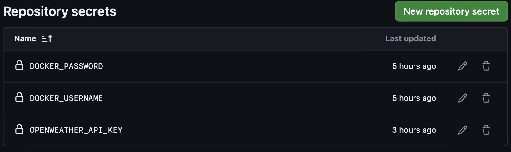
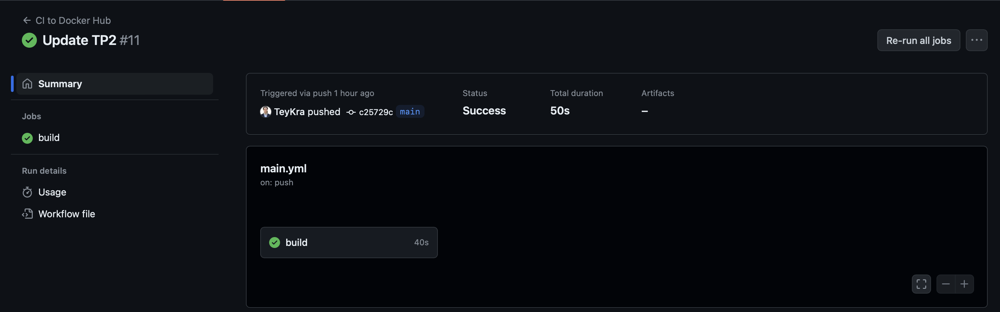
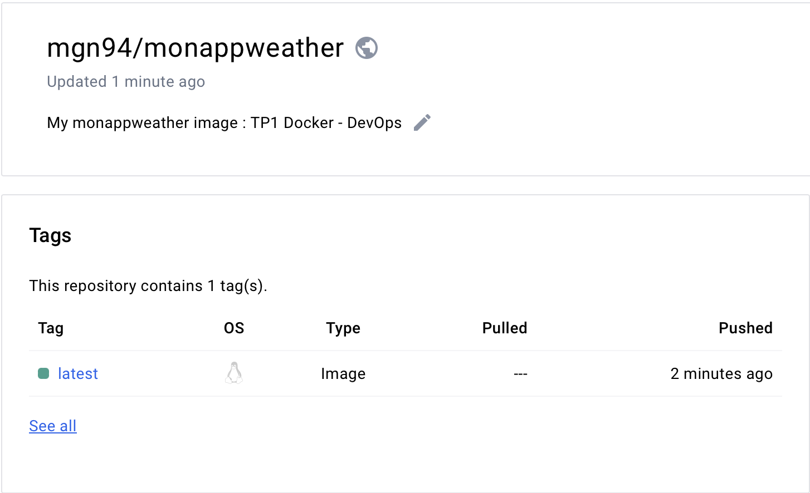

# DEVOPS - TP2: Github Action

## Objectives

- Configure a GitHub Actions workflow
- Transform a wrapper into an API
- Automatically publish to Docker Hub on each push
- Make your image (API format) available on DockerHub
- Make your code available in a GitHub repository

## Grading Criteria

- Code available on Github
- GitHub action that builds and pushes the image on each new commit
- Docker image available on DockerHub
- API that returns the weather using the following command using your image:
  
```shell
docker run --network host --env API_KEY=**** maregistry/efrei-devops-tp2:1.0.0
```

puis dans un autre terminal

```shell
curl "http://localhost:8081/?lat=5.902785&lon=102.754175"
```

## Bonus

- Add hadolint to Github workflow before build+push and failed on errors
- Aucune données sensibles stockées dans l'image ou le code source (i.e: openweather API key, Docker hub credentials)

# DevOps Application Deployment Project - Automated API Service with Docker and GitHub Actions

## Introduction

In continuation of deepening DevOps skills, Practical Work #2 is designed to highlight the advanced features of Continuous Integration and Continuous Deployment (CI/CD) through the use of GitHub Actions. The goal of this practical work is to transform a wrapper into a functional API that interacts with the OpenWeather service to obtain weather information via provided geographical coordinates. This project involves setting up a GitHub Action workflow that automates the building and pushing of the Docker image with each commit. The code will be hosted in a dedicated GitHub repository, while the API will be encapsulated in a Docker image to ensure its portability and ease its deployment. The final image will be published on DockerHub, making our work accessible and reusable by the community. This practical work underscores the importance of automation and efficient development practices in today's technological landscape, thereby reaffirming the fundamental principles of DevOps.

## Architecture

To meet the project's requirements, the following architecture has been employed:

### Components

We will maintain the same architecture as in Practical Work #1, adding the configuration file for the GitHub Action:

- **`main.yml`** in the folder **`.github/workflows`** is used to configure GitHub Actions, automating tasks such as compiling, testing, and deploying our code in response to specific events such as pushes or pull requests.

### Diagram

Below is the general structure of our project's architecture:


## Implementation Steps

Same implementation as Practical Work #1 except that we are adding : `.github / workflows`:


## GitHub repository secret



Here we have 3 repository secrets allowing us to contain sensitive information corresponding to the DockerHub credentials and the secret access key for the OpenWeather API.

## Code

### Explanation of the Flask Code for the Weather API (main.py)

This Flask code creates a simple API that retrieves weather information for specific geographic coordinates using the OpenWeather API.

#### Importation des Modules

```python
from flask import Flask, request, jsonify
import os
import requests
```

-**`Flask`** : The code is used to create the web application.
-**`request`** : To access the parameters of the HTTP request.
-**`jsonify`** : To format the response into JSON.
-**`os`** : To access environment variables.
-**`requests`** : To make HTTP requests to the external OpenWeather API.

#### Flask Application Initialization

```python
app = Flask(__name__)
```

- Creates an instance of the Flask application.

#### Route and Processing Function Definition

```python
@app.route('/')
def get_weather():
```

- Defines a root route (/) that responds to GET requests.

#### Retrieving Parameters and API Key

```python
    latitude = request.args.get('lat')
    longitude = request.args.get('lon')
    api_key = os.getenv('OPENWEATHER_API_KEY')
```

- Retrieves latitude and longitude from the parameters of the HTTP request.
- Retrieves the API key for the OpenWeatherMap API from the environment variables.

#### Checking for Parameter Presence

```python
    if not all([latitude, longitude, api_key]):
        return "Les variables d'environnement LATITUDE, LONGITUDE, et OPENWEATHER_API_KEY sont requises.", 400
```

- Checks if all necessary parameters are present. If not, returns an error message with HTTP code 400 (Bad Request).

#### Construction de la Requête à l'API OpenWeatherMap

```python
    BASE_URL = "http://api.openweathermap.org/data/2.5/weather"
    params = {
        'lat': latitude,
        'lon': longitude,
        'appid': api_key,
        'units': 'metric'
    }
    response = requests.get(BASE_URL, params=params)
```

- Sets the base URL for the API.
- Prepares the parameters for the request.
- Sends the request to the OpenWeatherMap API.

#### Processing the API Response

```python
    if response.status_code == 200:
        data = response.json()
        weather_description = data['weather'][0]['description']
        temperature = data['main']['temp']
        return jsonify({
            "city": data['name'],
            "country": data['sys']['country'],
            "weather_description": weather_description,
            "temperature": temperature
        })
    else:
        return jsonify({"error": "Failed to fetch weather data"}), response.status_code
```

- If the response is successful, extracts and returns the weather data.
- In case of failure, returns an error message and the corresponding HTTP status code.

#### Starting the Application

```python
if __name__ == '__main__':
    app.run(host='0.0.0.0', port=8081)
```

- Ensures that the Flask server starts only if the script is executed directly.
- Configures the server to listen on all network interfaces (useful for Docker containers).

## Explanation of the Dockerfile for the Weather API

Voici la traduction en anglais du texte que vous avez fourni :

This Dockerfile sets up a Docker environment for deploying a Flask application that queries the OpenWeather API.

### Using a Base Image

```dockerfile
FROM python:3.9-alpine
```

- Use the `python:3.9-alpine` image as the base. This image is based on Alpine Linux, which is known for its lightweight nature and security, minimizing vulnerabilities.

### Defining the Working Directory

```dockerfile 
WORKDIR /app
```

- Set `/app` as the working directory inside the container. All subsequent commands will be executed in this directory.

### Installing System Dependencies

```dockerfile 
RUN apk add --no-cache build-base=0.5-r3 libffi-dev=3.4.4-r3
```

- Install the necessary packages to compile certain Python packages that may have C components. `build-base` and `libffi-dev` are installed with fixed versions specifically to maintain reproducibility.

### Copying and Installing Python Dependencies

```dockerfile
COPY requirements.txt ./
RUN pip install --no-cache-dir -r requirements.txt
```

- Copy the `requirements.txt` file from the local directory to the working directory of the container.

- Execute `pip install` to install the Python packages listed in `requirements.txt` without caching the downloaded packages, thus reducing the size of the image.

### Copying Source Code Files

```dockerfile
COPY src/ ./
```

- Copy the source code files located in the `src` folder of the local directory to the working directory of the container.

### Defining Environment Variables

```dockerfile
ENV OPENWEATHER_API_KEY=""
ENV FLASK_APP=main.py
```

- Set `OPENWEATHER_API_KEY` as an environment variable with an empty default value. The actual API key will be passed at runtime, ensuring that sensitive data is not stored in the image.
- Set `FLASK_APP` to indicate to Flask which file to execute.

### Application Execution Command

```dockerfile
CMD ["flask", "run", "--host=0.0.0.0", "--port=8081"]
```

- Set the default command to execute the Flask application. The `--host=0.0.0.0` option allows the application to be accessible on all network interfaces of the container, and `--port=8081` specifies the port on which the application will be accessible.

## Explanation of the GitHub Actions File `main.yml`

This `main.yml` file defines a GitHub Actions workflow named "CI to Docker Hub," aimed at automating the building and publishing of a Docker image to Docker Hub whenever changes are pushed to the `main` branch.

### Workflow Triggers

```yaml
on:
  push:
    branches:
      - main
```

- This workflow is triggered by `push` events to the `main` branch.

### Workflow Jobs

#### Job build

```yaml
jobs:
  build:
    runs-on: ubuntu-latest
```

- Defines a job named `build` that runs on the latest available Ubuntu runner.

### Job Steps

#### Code Checkout

```yaml
- uses: actions/checkout@v2
```

- Use the `checkout@v2` action to clone the source code of the repository into the runner's environment.

#### Docker Buildx Configuration

```yaml 
- name: Set up Docker Buildx
  uses: docker/setup-buildx-action@v1
```

- Use `docker/setup-buildx-action@v1` to configure Docker Buildx, a Docker tool for building multi-architecture images.

#### Connecting to Docker Hub

```yaml
- name: Log in to Docker Hub
  uses: docker/login-action@v1
  with:
    username: ${{ secrets.DOCKER_USERNAME }}
    password: ${{ secrets.DOCKER_PASSWORD }}
```

- Use `docker/login-action@v1` to log in to Docker Hub using credentials stored as secrets in GitHub Actions.

#### Building and Publishing the Docker Image

```yaml
- name: Build and push Docker image
  uses: docker/build-push-action@v2
  with:
    context: .
    file: ./Dockerfile
    push: true
    tags: mgn94/monappweather:latest
  env:
    OPENWEATHER_API_KEY: ${{ secrets.OPENWEATHER_API_KEY }}
```

- Use `docker/build-push-action@v2` to build the Docker image from the specified Dockerfile and push it to Docker Hub with the `latest` tag.

- The OpenWeather API key is passed as an environment variable from GitHub secrets.

#### Linting the Dockerfile with Hadolint

```yaml
- name: Run Hadolint
  uses: hadolint/hadolint-action@v1.6.0
  with:
    dockerfile: Dockerfile
```

- Use `hadolint/hadolint-action@v1.6.0` to run Hadolint, which is a linter for Dockerfiles. This step ensures that the Dockerfile follows best practices.

## Explanation of the `requirements.txt` File

The `requirements.txt` file is used to manage dependencies for your Python project. It contains a list of external libraries that your application needs to function properly. 

### Dependencies

#### Flask

```plaintext
Flask
```

- **`Flask`**: This is a lightweight framework for developing web applications in Python. It's designed to make simple applications quickly and easily, with the ability to scale up to complex applications.

#### requests

```plaintext
requests
```

- **`requests`**: A library for sending HTTP/1.1 requests in Python. It's highly regarded for its simplicity and ease of use in performing tasks such as querying web APIs.

## Output

## Local Execution

##### Input

```shell
docker run --rm -e OPENWEATHER_API_KEY=b022acb509eacae0875ded1afe41a527 -e LATITUDE=31.2504 -e LONGITUDE=99.2506 monappweather
```

##### Output

```shell
La météo à Ganzi, CN est : broken clouds avec une température de -5.65°C.
```

#### API launch

##### Input

```shell
docker run -p 8081:8081 -e OPENWEATHER_API_KEY=$OPENWEATHER_API_KEY mgn94/monappweather:latest
```
##### Output

```shell 
 * Serving Flask app 'main.py'
 * Debug mode: off
WARNING: This is a development server. Do not use it in a production deployment. Use a production WSGI server instead.
 * Running on all addresses (0.0.0.0)
 * Running on http://127.0.0.1:8081
 * Running on http://172.17.0.2:8081
```

### Another Terminal (external to the IDE)

##### Input

```shell
curl "http://localhost:8081/?lat=40.7128&lon=-74.0060" 
```
##### Output

```shell
{"city":"New York","country":"US","temperature":10.38,"weather_description":"overcast clouds"}
```

##### Input

```shell
curl "http://localhost:8081/?lat=-33.8688&lon=151.2093" 
```

##### Output

```shell
{"city":"Sydney","country":"AU","temperature":15.39,"weather_description":"overcast clouds"}
```

##### Input

```shell
curl "http://localhost:8081/?lat=35.6895&lon=139.6917" 
```

##### Output

```shell
{"city":"Tokyo","country":"JP","temperature":15,"weather_description":"broken clouds"}
```

### Log Creation:

```shell
192.168.65.1 - - [11/Apr/2024 12:56:39] "GET /?lat=40.7128&lon=-74.0060 HTTP/1.1" 200 -
192.168.65.1 - - [11/Apr/2024 12:56:43] "GET /?lat=-33.8688&lon=151.2093 HTTP/1.1" 200 -
192.168.65.1 - - [11/Apr/2024 12:56:52] "GET /?lat=35.6895&lon=139.6917 HTTP/1.1" 200 -
```

### GitHub Action



### DockerHub



We can see that when we release a new version of our program to `github`, the `github action` starts loading to release the new version of our `docker image` to `Dockerhub`.

## Conclusion

In conclusion, this Practical Work #2 in DevOps effectively demonstrated the application of continuous integration and continuous deployment (CI/CD) principles through the development and deployment of a Dockerized API. By emphasizing essential DevOps skills such as automation, security, and accessibility, this work led to the successful implementation of a software solution that interacts with the OpenWeather API to retrieve weather data via geographical coordinates. Challenges encountered, particularly regarding the integration of quality controls and securing sensitive data through GitHub and DockerHub actions, were carefully managed, reinforcing the importance of rigorous development and security practices in the current technological ecosystem. The success of this project is demonstrated not only by the functionality of the API but also by its public availability on DockerHub, thereby promoting sharing and reuse within the DevOps community.